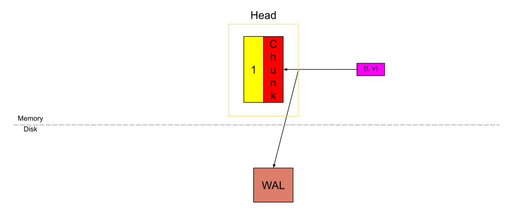
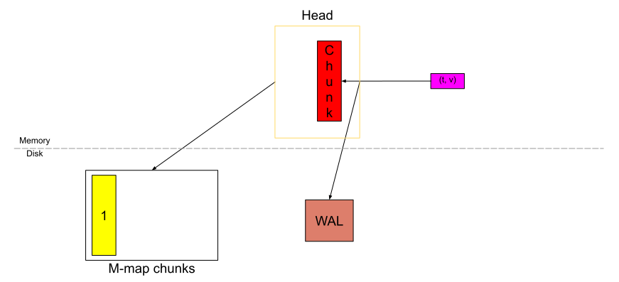

# Prometheus TSDB (Part 3): Memory Mapping of Head Chunks from Disk

[link](https://ganeshvernekar.com/blog/prometheus-tsdb-mmapping-head-chunks-from-disk/)

## Writing these chunks

Recapping from [Part 1](https://ganeshvernekar.com/blog/prometheus-tsdb-the-head-block/), when a chunk is full, we cut a new chunk and the older chunks become immutable and can only be read from (the yellow block below).



And instead of storing it in memory, we flush it to disk and store a reference to access it later.



This flushed chunk is the memory-mapped chunk from disk. The immutability is the most important factor here else rewriting compressed chunks would have been too inefficient for every sample.

## Format on disk

The format [can also be found on GitHub](https://github.com/prometheus/prometheus/blob/master/tsdb/docs/format/head_chunks.md).

### The File

These chunks stay in its own directory called `chunks_head` and have a file sequence similar to WAL (except it starts with 1). For example:

```sh
data
├── chunks_head
|   ├── 000001
|   └── 000002
└── wal
    ├── checkpoint.000003
    |   ├── 000000
    |   └── 000001
    ├── 000004
    └── 000005
```

The max size of the file is kept at 128MiB. Now diving deeper into a single file, the file contains a header of 8B.

Chunks in the files are referenced from the index by uint64 composed of in-file offset (lower 4 bytes) and segment sequence number (upper 4 bytes).

```sh
┌──────────────────────────────┐
│  magic(0x0130BC91) <4 byte>  │
├──────────────────────────────┤
│    version(1) <1 byte>       │
├──────────────────────────────┤
│    padding(0) <3 byte>       │
├──────────────────────────────┤
│ ┌──────────────────────────┐ │
│ │         Chunk 1          │ │
│ ├──────────────────────────┤ │
│ │          ...             │ │
│ ├──────────────────────────┤ │
│ │         Chunk N          │ │
│ └──────────────────────────┘ │
└──────────────────────────────┘
```

`Magic Number` is any number that can uniquely identify the file as a memory-mapped head chunks file. `Chunk Format` tells us how to decode the chunks in the file. The extra padding is to allow any future header options that we might require.

### Chunks

A single chunk looks like this

```sh
┌─────────────────────┬───────────────────────┬───────────────────────┬───────────────────┬───────────────┬──────────────┬────────────────┐
| series ref <8 byte> | mint <8 byte, uint64> | maxt <8 byte, uint64> | encoding <1 byte> | len <uvarint> | data <bytes> │ CRC32 <4 byte> │
└─────────────────────┴───────────────────────┴───────────────────────┴───────────────────┴───────────────┴──────────────┴────────────────┘
```

- The `series ref` is the same series reference that we talked about in Part 2, it is the series id used to access the series in the memory. 
- The `mint` and `maxt` are the minimum and maximum timestamp seen in the samples of the chunk.
-  `encoding` is the encoding used to compress the chunks.
- `len` is the number of bytes that follow from here
-  `data` are the actual bytes of the compressed chunk.
- `CRC32` is the checksum of the above content of the chunk used to check the integrity of the data.

Unlike chunks in the on-disk blocks, here we additionally store series reference that the chunks belongs to and the mint/maxt of the chunks. This is because we don't have an index associated with these chunks, hence these meta information are used while replaying the chunks.

## Reading these chunks

For every chunk, the Head block stores the mint and maxt of that chunk along with a reference in the memory to access it.

The reference is 8 bytes long. The first 4 bytes tell the file number in which the chunk exists, and the last 4 bytes tell the offset in the file where the chunk starts (i.e. the first byte of the `series ref`). If the chunk was in the file `00093` and the `series ref` starts at byte offset `1234` in the file, then the reference of that chunk would be `(93 << 32) | 1234` .

We store the `mint` and `maxt` in Head so that we can select the chunk without having to look at the disk. When we do have to access the chunk, we only access the encoding and the chunk data using the reference.

In the code, the file looks like yet another byte slice (one slice per file) and accessing the slice at some index to get the chunk data while the OS maps the slice in the memory to the disk under the hood. [Memory-mapping from disk](https://en.wikipedia.org/wiki/Memory-mapped_file) is an OS feature which fetches only the part of disk into memory which is being accessed and not the entire file.

## Replaying on startup

In [Part 2](https://ganeshvernekar.com/blog/prometheus-tsdb-wal-and-checkpoint/) we talked about WAL replay where we replay each individual sample to re-create the compressed chunk. Now that we have the compressed full chunks on disk, we don't need to go through recreation of these chunks while **we still need to create chunks from WAL which were not full**. Now with these memory-mapped chunks from disk, the replay happens as follows.

At startup, first we iterate through all the chunks in the `chunks_head` directory and build a map of `series ref -> [list of chunk references along with mint and maxt belonging to this series ref]` in the memory.

We then continue with the WAL replay as described in [Part 2](https://ganeshvernekar.com/blog/prometheus-tsdb-wal-and-checkpoint/) but with few modification:

- When we come across the `Series` record, after creation of the series, we look for the series reference in the above map and if any memory-mapped chunks exist, we attach that list to this series.
- When we come across the `Samples` record, if the corresponding series for the sample has any memory-mapped chunks and if the sample falls into the time ranges that it covers, then we skip the sample. If it does not, then we ingest that sample into the Head block.

## Enhancements that this brings in

What's the use of this additional complexity while we could get away with storing chunks in the memory and the WAL? This feature was added recently in 2020, so let's see what this brings in. (You can see some benchmark graphs in [this Grafana Labs blog post](https://grafana.com/blog/2020/06/10/new-in-prometheus-v2.19.0-memory-mapping-of-full-chunks-of-the-head-block-reduces-memory-usage-by-as-much-as-40/))

### Memory savings

If you had to store the chunk in the memory, it can take anywhere between 120 to 200 bytes (or even more depending on compressibility of the samples). Now this is replaced with 24 bytes - 8 bytes each of chunks reference, min time, and max time of the chunk.

While this may sound like 80-90% reduction in memory, the reality is different. There are more things that the Head needs to store, like the in-memory index, all the symbols (label values), etc, and other parts of TSDB that take some memory.

In the real world, we can see a 15-50% reduction in the memory footprint depending on the rate at which samples are being scraped and the rate at which new series are being created (called "churn"). Another thing to note is that, if you are running some queries which touch a lot of these chunks on disk, then they need to be loaded into the memory to be processed. So it's not an absolute reduction in peak memory usage.

### Faster startup

The WAL replay is the slowest part of startup. Mainly, (1) decoding of WAL records from disk and (2) rebuilding the compressed chunks from individual samples, are the slow parts in the replay. The iteration of memory-mapped chunks is relatively fast.

We cannot avoid decoding of records as we need to check all the records. As you saw above in the replay, we are skipping the samples which are in the memory-mapped chunks range. Here we avoid re-creating those full compressed chunks, hence save some time in the replay. It has been seen to reduce the startup time by 15-30%.

## Garbage collection

The garbage collection in memory happens during the Head truncation where it just drops the reference of the chunks which is older than the truncation time `T`. But the files are still present on the disk. As with WAL segments, we also need to delete old m-mapped files regularly.

For every memory-mapped chunk file present (which means also open in TSDB), we store in the memory the absolute maximum time among all the chunks present in the file. For the live file (the one in which we are currently writing the chunks), we update this maximum time in the memory as and when we are adding new chunks. During a restart, as we iterate all the memory-mapped chunks, we restore the maximum time of the files in the memory there.

So when the Head truncation is happening for data before time `T`, we call truncation on these files for time `T`. The files whose maximum times is below `T` (except the live file) are deleted at this point while preserving the sequence (if the files were `5, 6, 7, 8` and if files `5` and `7` were beyond time `T`, only `5` is deleted and the remaining sequence would be `6, 7, 8`).

After truncation, we close the live file and start a new one because in low volume and small setups, it might take a lot of time to reach the max size of the file. So rotating the files here will help deletion of old chunks during the next truncation.

## Code reference

[`tsdb/chunks/head_chunks.go`](https://github.com/prometheus/prometheus/blob/master/tsdb/chunks/head_chunks.go) has all the implementation of writing chunks to disk, accessing it using a reference, truncation, handling the files, and way to iterate over the chunks.

[`tsdb/head.go`](https://github.com/prometheus/prometheus/blob/master/tsdb/head.go) uses the above as a black box to memory-map its chunks from disk.