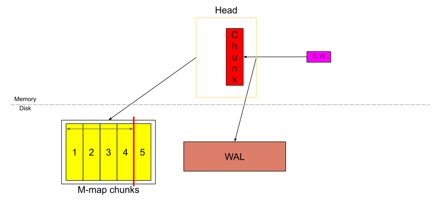
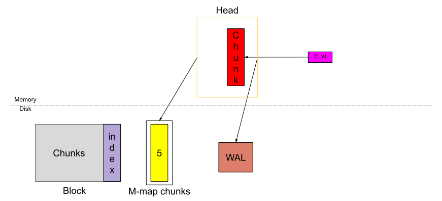
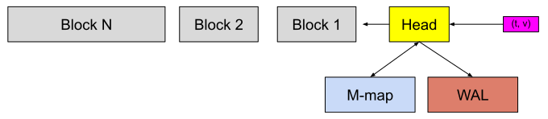

# Prometheus TSDB (Part 4): Persistent Block and its Index

[link](https://ganeshvernekar.com/blog/prometheus-tsdb-persistent-block-and-its-index)

## What's a persistent block and when is it created

A block on disk is a collection of chunks for a fixed time range consisting of its own index. It is a directory with multiple files inside it. **Every block has a unique ID**, which is a [Universally Unique Lexicographically Sortable Identifier (ULID)](https://github.com/oklog/ulid).

A block has an interesting property that the samples in it are immutable. If you want to add more samples, or delete some, or update some, you have to rewrite the entire block with the required modifications and the new block has a new ID.  There is no relationship between these 2 blocks.

We saw in [Part 1](https://ganeshvernekar.com/blog/prometheus-tsdb-the-head-block/) that when the Head block fills up with data ranging `chunkRange*3/2` in time, we take the first `chunkRange` of data and convert into a persistent block.





Here we call that `chunkRange` as `blockRange` in the context of blocks, and the first block cut from the Head spans `2h` by default in Prometheus.



When the blocks get old, multiple blocks are compacted (or merged) to form a new bigger block while the old ones are deleted. So **we have 2 ways of creating a block, from the Head and from existing blocks**. We will look into compaction in future blog posts.

## Contents of a block

A block consists of 4 parts

1. `meta.json` (file): the metadata of the block.
2. `chunks` (directory): contains the raw chunks without any metadata about the chunks.
3. `index` (file): the index of this block.
4. `tombstones` (file): deletion markers to exclude samples when querying the block.

With `01EM6Q6A1YPX4G9TEB20J22B2R` as an example of block ID, here is how the files look on disk

```sh
data
├── 01EM6Q6A1YPX4G9TEB20J22B2R
|   ├── chunks
|   |   ├── 000001
|   |   └── 000002
|   ├── index
|   ├── meta.json
|   └── tombstones
├── chunks_head
|   ├── 000001
|   └── 000002
└── wal
    ├── checkpoint.000003
    |   ├── 000000
    |   └── 000001
    ├── 000004
    └── 000005
```

### meta.json

This contains all the required metadata for the block as a whole. Here is an example:

```sh
{
    "ulid": "01EM6Q6A1YPX4G9TEB20J22B2R",
    "minTime": 1602237600000,
    "maxTime": 1602244800000,
    "stats": {
        "numSamples": 553673232,
        "numSeries": 1346066,
        "numChunks": 4440437
    },
    "compaction": {
        "level": 1,
        "sources": [
            "01EM65SHSX4VARXBBHBF0M0FDS",
            "01EM6GAJSYWSQQRDY782EA5ZPN"
        ]
    },
    "version": 1
}
```

- `version` tells us how to parse the meta file. 
- `ulid`: Though the directory name is set to the ULID, only the one present in the `meta.json` as `ulid` is the valid ID, the directory name can be anything.
- `minTime` and `maxTime` is the absolute minumum and maximum timestamp among all the chunks present in the block.
- `stats` tell the number of series, samples, and chunks present in the block.
- `compaction` tells the history of the block. 
  - `level` tells how many generations has this block seen.
  - `sources` tell from which blocks was this block created (i.e. block which were merged to form this block). If it was created from Head block, then the `sources` is set to itself (`01EM6Q6A1YPX4G9TEB20J22B2R` in this case).

### chunks

The `chunks` directory contains a sequence of numbered files similar to the WAL/checkpoint/head chunks. Each file is capped(上限) at 512MiB. This is the format of an individual file inside this directory:

```sh
┌──────────────────────────────┐
│  magic(0x85BD40DD) <4 byte>  │
├──────────────────────────────┤
│    version(1) <1 byte>       │
├──────────────────────────────┤
│    padding(0) <3 byte>       │
├──────────────────────────────┤
│ ┌──────────────────────────┐ │
│ │         Chunk 1          │ │
│ ├──────────────────────────┤ │
│ │          ...             │ │
│ ├──────────────────────────┤ │
│ │         Chunk N          │ │
│ └──────────────────────────┘ │
└──────────────────────────────┘
```

It looks very similar to [the memory-mapped head chunks file](https://ganeshvernekar.com/blog/prometheus-tsdb-mmapping-head-chunks-from-disk/#the-file). The `magic` number identifies this file as a chunks file. `version` tells us how to parse this file. `padding` is for any future headers. This is then followed by a list of chunks.

Here is the format of an indivudual chunk:

```sh
┌───────────────┬───────────────────┬──────────────┬────────────────┐
│ len <uvarint> │ encoding <1 byte> │ data <bytes> │ CRC32 <4 byte> │
└───────────────┴───────────────────┴──────────────┴────────────────┘
```

- `<uvarint>` has 1 to 10 bytes.
- `encoding`: Currently either `XOR` or `histogram`.
- `data`: See below for each encoding.

It again looks similar to [the memory-mapped head chunks on disk](https://ganeshvernekar.com/blog/prometheus-tsdb-mmapping-head-chunks-from-disk/#chunks) except that it is missing the `series ref`, `mint` and `maxt`. We needed this additional information for the Head chunks to recreate the in-memory index during startup. But in the case of blocks, we have this additonal information in the `index`, because index is the place where it finally belongs, hence we don't need it here.

To access these chunks, we again need the chunk reference that we talked in [Part 3](https://ganeshvernekar.com/blog/prometheus-tsdb-mmapping-head-chunks-from-disk/). Repeating what I had said: The reference is 8 bytes long. The first 4 bytes tell the file number in which the chunk exists, and the last 4 bytes tell the offset in the file where the chunk starts (i.e. the first byte of the `len`). If the chunk was in the file `00093` and the `len` of the chunk starts at byte offset `1234` in the file, then the reference of that chunk would be `(92 << 32) | 1234` (left shift bits and then bitwise OR). While the file names use 1 based indexing, the chunks references use 0 based indexing. Hence `00093` got converted to `92` when calculating the chunk reference.

**TODO**

Here is the [link](https://github.com/prometheus/prometheus/blob/master/tsdb/docs/format/chunks.md) for the upstream docs on the `chunks` format.

### Index

Index contains all that you need to query the data of this block. It does not share any data with any other blocks or external entity which makes it possible to read/query the block without any dependencies.

The index is an "inverted index"(倒排索引) which is also widely used in indexing documents. Fabian talks more about inverted index in [his blog post](https://fabxc.org/tsdb/), hence I am skipping that topic here since this post is too long already.

Here is the high level view of the index which we will dive into shortly.

```sh
┌────────────────────────────┬─────────────────────┐
│ magic(0xBAAAD700) <4b>     │ version(1) <1 byte> │
├────────────────────────────┴─────────────────────┤
│ ┌──────────────────────────────────────────────┐ │
│ │                 Symbol Table                 │ │
│ ├──────────────────────────────────────────────┤ │
│ │                    Series                    │ │
│ ├──────────────────────────────────────────────┤ │
│ │                 Label Index 1                │ │
│ ├──────────────────────────────────────────────┤ │
│ │                      ...                     │ │
│ ├──────────────────────────────────────────────┤ │
│ │                 Label Index N                │ │
│ ├──────────────────────────────────────────────┤ │
│ │                   Postings 1                 │ │
│ ├──────────────────────────────────────────────┤ │
│ │                      ...                     │ │
│ ├──────────────────────────────────────────────┤ │
│ │                   Postings N                 │ │
│ ├──────────────────────────────────────────────┤ │
│ │              Label Offset Table              │ │
│ ├──────────────────────────────────────────────┤ │
│ │             Postings Offset Table            │ │
│ ├──────────────────────────────────────────────┤ │
│ │                      TOC                     │ │
│ └──────────────────────────────────────────────┘ │
└──────────────────────────────────────────────────┘
```

- Same as other files, the `magic` number identifies this file as an index file. 

- `version` tells us how to parse this file. 

- The entry point(入口) to this index is the `TOC`, which stands for Table Of Contents.

#### TOC

```sh
┌─────────────────────────────────────────┐
│ ref(symbols) <8b>                       │ -> Symbol Table
├─────────────────────────────────────────┤
│ ref(series) <8b>                        │ -> Series
├─────────────────────────────────────────┤
│ ref(label indices start) <8b>           │ -> Label Index 1
├─────────────────────────────────────────┤
│ ref(label offset table) <8b>            │ -> Label Offset Table
├─────────────────────────────────────────┤
│ ref(postings start) <8b>                │ -> Postings 1
├─────────────────────────────────────────┤
│ ref(postings offset table) <8b>         │ -> Postings Offset Table
├─────────────────────────────────────────┤
│ CRC32 <4b>                              │
└─────────────────────────────────────────┘
```

It tells us where exactly (the byte offset in the file) do the individual components of the index start. I have marked what do each reference point to in the index format above. The starting point of next component also tell us where do individual components end. If any of the reference is `0`, it indicates that the corresponding section does not exist in the index, and hence should be skipped while reading.

Since `TOC` is fixed size, the last 52 bytes of the file can be taken as the `TOC`.

As you will notice in the coming sections, each component will have its own checksum, i.e. `CRC32` to check for the integrity of the underlying data.

#### Symbol Table

This section holds a sorted list of deduplicated strings which are found in label pairs of all the series in this block. For example if the series is `{a="y", x="b"}`, then the symbols would be `"a", "b", "x", "y"`.

```sh
┌────────────────────┬─────────────────────┐
│ len <4b>           │ #symbols <4b>       │
├────────────────────┴─────────────────────┤
│ ┌──────────────────────┬───────────────┐ │
│ │ len(str_1) <uvarint> │ str_1 <bytes> │ │
│ ├──────────────────────┴───────────────┤ │
│ │                . . .                 │ │
│ ├──────────────────────┬───────────────┤ │
│ │ len(str_n) <uvarint> │ str_n <bytes> │ │
│ └──────────────────────┴───────────────┘ │
├──────────────────────────────────────────┤
│ CRC32 <4b>                               │
└──────────────────────────────────────────┘
```

The `len <4b>` is the number of bytes in this section and `#symbols` is the number of symbols. It is followed by `#symbols` number of utf-8 encoded strings, where each string has its length prefixed followed by the raw bytes of the string. Checksum (`CRC32`) for integrity.

The other sections in the index can refer to this symbol table for any strings and hence significantly reduce the index size. The byte offset at which the symbol starts in the file (i.e. the start of `len(str_i)`) forms the reference for the corresponding symbol which can be used in other places instead of the actual string. When you want the actual string, you can use the offset to get it from this table.

#### Series

This section contains a list of all the series information present in this blocks. The series are sorted lexicographically by their label sets.

```sh
┌───────────────────────────────────────┐
│ ┌───────────────────────────────────┐ │
│ │   series_1                        │ │
│ ├───────────────────────────────────┤ │
│ │                 . . .             │ │
│ ├───────────────────────────────────┤ │
│ │   series_n                        │ │
│ └───────────────────────────────────┘ │
└───────────────────────────────────────┘
```

Each series entry is 16 byte aligned, which means the byte offset at which the series starts is divisible by 16. Hence we set the ID of the series to be `offset/16` where offset points to the start of the series entry. This ID is used to reference this series and whenever you want to access the series, you can get the location in the index by doing `ID*16`.

Since the series are lexicographically sorted by their label sets, a sorted list of series IDs implies a sorted list of series label sets.

Here comes a confusing part for many in the index: what is a ***posting***? The above series ID *is a posting*. So whenever we say posting in the context of Prometheus TSDB, it refers to a series ID. But why posting? Here is my best guess: in the world of indexing the documents and its words with an inverted index, the document IDs are usually called a "posting" in the index. Here you can consider a series to be a document and a label-value pair of a series to be words in the document. Series ID -> document ID, document ID -> posting, series ID -> posting.

Each entry holds the label set of the series and references to all the chunks belonging to this series (the reference is the one from the `chunks` directory).

```sh
┌──────────────────────────────────────────────────────────────────────────┐
│ len <uvarint>                                                            │
├──────────────────────────────────────────────────────────────────────────┤
│ ┌──────────────────────────────────────────────────────────────────────┐ │
│ │                     labels count <uvarint64>                         │ │
│ ├──────────────────────────────────────────────────────────────────────┤ │
│ │              ┌────────────────────────────────────────────┐          │ │
│ │              │ ref(l_i.name) <uvarint32>                  │          │ │
│ │              ├────────────────────────────────────────────┤          │ │
│ │              │ ref(l_i.value) <uvarint32>                 │          │ │
│ │              └────────────────────────────────────────────┘          │ │
│ │                             ...                                      │ │
│ ├──────────────────────────────────────────────────────────────────────┤ │
│ │                     chunks count <uvarint64>                         │ │
│ ├──────────────────────────────────────────────────────────────────────┤ │
│ │              ┌────────────────────────────────────────────┐          │ │
│ │              │ c_0.mint <varint64>                        │          │ │
│ │              ├────────────────────────────────────────────┤          │ │
│ │              │ c_0.maxt - c_0.mint <uvarint64>            │          │ │
│ │              ├────────────────────────────────────────────┤          │ │
│ │              │ ref(c_0.data) <uvarint64>                  │          │ │
│ │              └────────────────────────────────────────────┘          │ │
│ │              ┌────────────────────────────────────────────┐          │ │
│ │              │ c_i.mint - c_i-1.maxt <uvarint64>          │          │ │
│ │              ├────────────────────────────────────────────┤          │ │
│ │              │ c_i.maxt - c_i.mint <uvarint64>            │          │ │
│ │              ├────────────────────────────────────────────┤          │ │
│ │              │ ref(c_i.data) - ref(c_i-1.data) <varint64> │          │ │
│ │              └────────────────────────────────────────────┘          │ │
│ │                             ...                                      │ │
│ └──────────────────────────────────────────────────────────────────────┘ │
├──────────────────────────────────────────────────────────────────────────┤
│ CRC32 <4b>                                                               │
└──────────────────────────────────────────────────────────────────────────┘
```

The starting `len` and ending `CRC32` is same as before. The series entry starts with number of label-value pairs present in the series, as `labels count`, followed by lexicographically ordered (w.r.t. label name) label-value pairs, Instead of storing the actual string itself, we use the symbol reference here from the symbol table. If the series was `{a="y", x="b"}`, the series entry for it would include symbol reference for `"a", "y", "x", "b"` in the same order.

Next is the number of chunks (`chunks count`) that belongs to this series in the `chunks` directory. And this is followed by a sequence of metadata about the indexed chunks containing the min time (timestamp of first sample) and max time (timestamp of last sample) of the chunk and its reference in the `chunks` directory. These are sorted by the `mint` of the chunks. If you noticed the above format, we are actually storing `mint` and `maxt` by taking the different with the previous timestamp (mint of the same chunk or maxt of previous chunk). This reduces the size of the chunk metadata since these form a huge part of the index by size.

Holding the `mint` and `maxt` in the index allows queries to skip the chunks which are not required for the queried time range. This is different from the m-mapped Head chunks from disk where `mint` and `maxt` are with the chunks to restore them in the in-memory index of Head during startup.

#### Label Offset Table and Label Index i

Both of these are coupled(耦合的), so we will discuss both together. `Label Index i` refers to any of `Label Index 1 ... Label Index N` in the index; we will talk about a single entry `Label Index i`.

These two are ***not used anymore***; they are *written* for backward compatibility but *not read from* in the latest Prometheus version. However, it is useful to understand the use of these parts and we will see in the next section what is it replaced with.

The aim of these sections is to index the possible values for a label name. For example if we have two series `{a="b1", x="y1"}` and `{a="b2", x="y2"}`, this section allows us to identify that the possible values for label name `a` are `[b1, b2]` and for `x` they are `[y1, y2]`. The format also allows indexing something like the label names `(a, x)` have the possible values `[(b1, y1), (b2, y2)]`, but we don't use this in Prometheus.

##### Label Index i

This is the format of a single `Label Index i` entry, so we have multiple of of these in sequence in no particular order. This is the format for a single `Label Index i`:

```sh
┌───────────────┬────────────────┬────────────────┐
│ len <4b>      │ #names <4b>    │ #entries <4b>  │
├───────────────┴────────────────┴────────────────┤
│ ┌─────────────────────────────────────────────┐ │
│ │ ref(value_0) <4b>                           │ │
│ ├─────────────────────────────────────────────┤ │
│ │ ...                                         │ │
│ ├─────────────────────────────────────────────┤ │
│ │ ref(value_n) <4b>                           │ │
│ └─────────────────────────────────────────────┘ │
│                      . . .                      │
├─────────────────────────────────────────────────┤
│ CRC32 <4b>                                      │
└─────────────────────────────────────────────────┘
```

From the above examples, this helps us store the list `[b1, b2]`, `[y1, y2]`, `[(b1, y1), (b2, y2)]`, while each list getting its own entry in the index. `len` and `CRC32` is same as before.

`#names` is the number of label names the values are for. For example if we are indexing for `a` or `x`, `#names` would be 1. If we are indexing for `(a, x)`, i.e. 2 label names, then `#names` would be 2.

`#entries` is the number of possible values for the label names. If the names are `a` or `x` or even `(a, x)`, `#entries` is 2 because they have 2 possible values each.

It is followed by `#names * #entries` number of references to the value symbols.

Example for `[b1, b2]`

```sh
┌────┬───┬───┬─────────┬─────────┬───────┐
│ 16 │ 1 │ 2 │ ref(b1) | ref(b2) | CRC32 |
└────┴───┴───┴─────────┴─────────┴───────┘
```

Example for `[(b1, y1), (b2, y2)]`

```sh
┌────┬───┬───┬─────────┬─────────┬─────────┬─────────┬───────┐
│ 24 │ 2 │ 2 │ ref(b1) | ref(y1) │ ref(b2) | ref(y2) | CRC32 |
└────┴───┴───┴─────────┴─────────┴─────────┴─────────┴───────┘
```

##### Label Offset Table

While the `Label Index i` stores the list of possible values, `Label Offset Table` brings together the labels names and completes the label name-value index.

Here is the format of `Label Offset Table`

```sh
┌─────────────────────┬──────────────────────┐
│ len <4b>            │ #entries <4b>        │
├─────────────────────┴──────────────────────┤
│ ┌────────────────────────────────────────┐ │
│ │  n = 1 <1b>                            │ │
│ ├──────────────────────┬─────────────────┤ │
│ │ len(name) <uvarint>  │ name <bytes>    │ │
│ ├──────────────────────┴─────────────────┤ │
│ │  offset <uvarint64>                    │ │
│ └────────────────────────────────────────┘ │
│                    . . .                   │
├────────────────────────────────────────────┤
│  CRC32 <4b>                                │
└────────────────────────────────────────────┘
```

This stores sequence of entries to point label name to its possible values, for example, point `a` to the above `Label Index i` containing `[b1, b2]`.

The above table has `len` and `CRC32` like other parts. `#entries` is the number of entries in this table. Followed by the actual entries.

Each entry start with `n` which is number of label names, followed by `n` number of actual label names and not symbols. If you noticed, the string `len(name) <uvarint> │ name <bytes>` is same as how we stored in the symbol table. In Prometheus, we only have `n=1`, which means we only index possible label values for single label name, and not for tuples like `(a, x)`, because the possible number of such combinations would be huge and not practical to store them all.

Since we index single label names, we can afford to store the string directly as the number of label names are usually small and hence prevent loading of disk page from symbol table for the label name lookup.

The entry ends with an offset in the file which points to the start of relevant `Label Index i`. For example, for label name `a`, the offset will point to the `Label Index i` storing `[b1, b2]`. Label name `x` will point to the `Label Index i` storing `[y1, y2]`.

Since we are only indexing individual label names, we also don't store the `Label Index i` for tuples like `(a, x)` though we saw an example above that it is possible to do. It was [once considered to have such composite label value index](https://github.com/prometheus-junkyard/tsdb/issues/26), but it was dropped as there were not many use cases for it.

#### Postings Offset Table and Postings i

These two are linked in a similar way as above where `Postings i` stores a list of postings and `Postings Offset Table` refers to those entries with the offset. If you can recall, a posting is a series ID, which in the context of this index is the offset at which the series entry starts in the file divided by 16 since it's 16 byte aligned.

##### Postings i

A single `Postings i` represents a "postings list", which is basically a sorted list of postings. Let us see the format of an individual such list and we will work with an example.

```sh
┌────────────────────┬────────────────────┐
│ len <4b>           │ #entries <4b>      │
├────────────────────┴────────────────────┤
│ ┌─────────────────────────────────────┐ │
│ │ ref(series_1) <4b>                  │ │
│ ├─────────────────────────────────────┤ │
│ │ ...                                 │ │
│ ├─────────────────────────────────────┤ │
│ │ ref(series_n) <4b>                  │ │
│ └─────────────────────────────────────┘ │
├─────────────────────────────────────────┤
│ CRC32 <4b>                              │
└─────────────────────────────────────────┘
```

This format cannot get much simpler. It has `len` and `CRC32` as usual. Followed by `#entries` which is the number of postings in this list, and then a sorted list of `#entries` number postings (series IDs, which is also the reference).

You might be wondering which postings do we store in this list. Let's take an example of these two series: `{a="b", x="y1"}` with series ID `120`, `{a="b", x="y2"}` with series ID `145`. Similar to how we looked at possible label values for a label name above, here we look at the possible series for a label-value pair. From the above example, `a="b"` is present in both the series, so we have to store a list `[120, 145]`. For `x="y1"` and `x="y2"`, they appear in only one of the series, so we have to store `[120]` and `[145]` for them respectively.

We only store the lists for the label pairs that we see in the series. So in the above example, we don't store postings list for something like `a="y1"` or `x="b"`, because they never appear in any series.

##### Postings Offset Table

Like how the `Label Offset Table` points a label name to possible values in `Label Index i`, similarly `Postings Offset Table` points a label-pair to possible postings in `Postings i`.

```sh
┌─────────────────────┬──────────────────────┐
│ len <4b>            │ #entries <4b>        │
├─────────────────────┴──────────────────────┤
│ ┌────────────────────────────────────────┐ │
│ │  n = 2 <1b>                            │ │
│ ├──────────────────────┬─────────────────┤ │
│ │ len(name) <uvarint>  │ name <bytes>    │ │
│ ├──────────────────────┼─────────────────┤ │
│ │ len(value) <uvarint> │ value <bytes>   │ │
│ ├──────────────────────┴─────────────────┤ │
│ │  offset <uvarint64>                    │ │
│ └────────────────────────────────────────┘ │
│                    . . .                   │
├────────────────────────────────────────────┤
│  CRC32 <4b>                                │
└────────────────────────────────────────────┘
```

This looks very similar to the `Label Offset Table`, but with an addition of the label value. `len` and `CRC32` is as usual.

`#entries` is the number of entries in this table. `n` is always 2, which tells number of string elements that follow (i.e. a label name and a label value). Since we have `n` here, the table could possibly index composite label pairs like `(a="b", x="y1")`, but we don't do it as the use cases for that are very limited and don't have a good trade-off.

`n` is followed by the actual string for the label name and the label value. Again, the individual label pairs are not a lot in general, hence we can afford storing the raw string here and avoid an indirection to the symbol table as this table will be accessed a lot of time. The main saving from the symbol table comes in the `Series` sections where the same symbol is repeated many times.

A single entry ends with an offset to the start of a postings list `Postings i`. From above example, an entry for `name="a", value="b"` will point to the postings list `[120, 145]`, entry for `name="x", value="y1"` will point to the postings list `[120]`.

The entries are sorted based on the label name and the value, first w.r.t. the name and for pairs with same names it's done w.r.t. the value. This allows us to run a **binary search** for the required label pair. Additionally, to get possible values for a given label name, we can get to the first label-pair that matches the name and iterate from there to get all the value. Hence this table replaces the `Label Offset Table` and `Label Index i`. This is another reason to store the actual strings here for faster access of label values.

This postings list and postings offset table form the inverted index. For indexing documents using an inverted index, for every word, we store a list of documents that it appears in. Similarly here, for every label-value pair, we store the list of series that it appears in.

This marks the end of the giant `index` section. Here is the [link](https://github.com/prometheus/prometheus/blob/master/tsdb/docs/format/index.md) for the upstream docs on the `index` format.

### tombstones

Tombstones are deletion markers, i.e., they tell us what time ranges of which series to ignore during reads. This is the only file in the block which is created and modified after writing a block to store the delete requests.

This is how the file looks

```sh
┌────────────────────────────┬─────────────────────┐
│ magic(0x0130BA30) <4b>     │ version(1) <1 byte> │
├────────────────────────────┴─────────────────────┤
│ ┌──────────────────────────────────────────────┐ │
│ │                Tombstone 1                   │ │
│ ├──────────────────────────────────────────────┤ │
│ │                      ...                     │ │
│ ├──────────────────────────────────────────────┤ │
│ │                Tombstone N                   │ │
│ ├──────────────────────────────────────────────┤ │
│ │                  CRC<4b>                     │ │
│ └──────────────────────────────────────────────┘ │
└──────────────────────────────────────────────────┘
```

The `magic` number tells that this is a tombtones file (guess whose birthday is this number? hint: a Prometheus maintainer who implemented deletions in TSDB). The `version` tells us how to parse the file. It is followed by a sequence of tombstones which we will look at in just a second. The file ends with a checksum (`CRC32`) over all the tombstones.

Each individual tombstone looks like this

```sh
┌────────────────────────┬─────────────────┬─────────────────┐
│ series ref <uvarint64> │ mint <varint64> │ maxt <varint64> │
└────────────────────────┴─────────────────┴─────────────────┘
```

The first field is the series reference (aka series ID, aka a posting) to which this tombstone belongs to. The `mint` through `maxt` is the time range that the deletion refers to, hence we should be skipping that time range for the series mentioned by the `series ref` while reading the chunks. When a single series has multiple non-overlapping deleted time ranges, they result in more than 1 tombtone.

Here is the [link](https://github.com/prometheus/prometheus/blob/master/tsdb/docs/format/tombstones.md) for the upstream docs on the `tombstones` format.

## Code reference

[`tsdb/block.go`](https://github.com/prometheus/prometheus/blob/master/tsdb/block.go) has the code for reading and writing the meta file. In general, this is the hub for all things persistent block.

[`tsdb/chunks/chunks.go`](https://github.com/prometheus/prometheus/blob/master/tsdb/chunks/chunks.go) has the code for reading and writing the files in the `chunks` directory.

[`tsdb/index/index.go`](https://github.com/prometheus/prometheus/blob/master/tsdb/index/index.go) has the code for reading and writing the index file.

[`tsdb/tombstones/tombstones.go`](https://github.com/prometheus/prometheus/blob/master/tsdb/tombstones/tombstones.go) has the code for reading and writing the tombstones file.

All these files point to the implementation of individual components of the block. We will see the code which brings all this together during the reading and writing of a block in the queries and compaction blog posts respectively.
