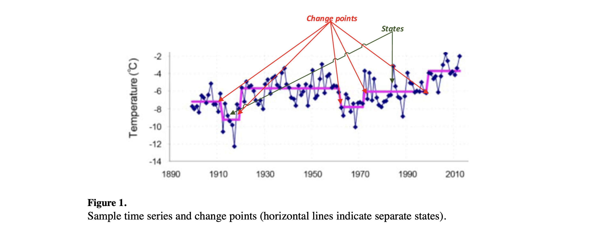
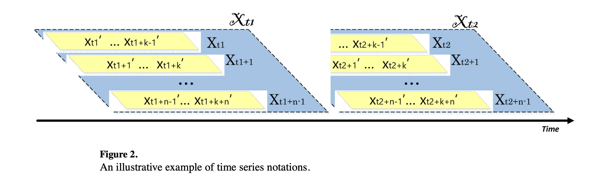
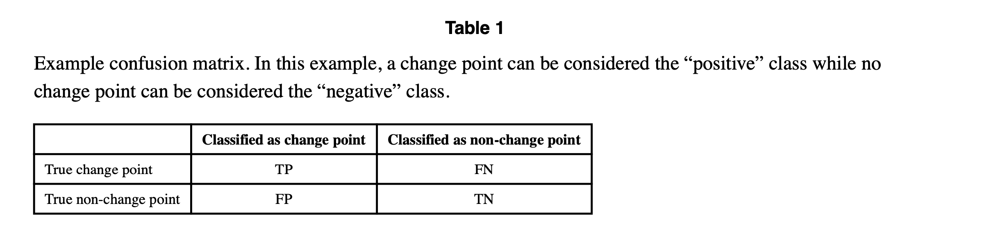
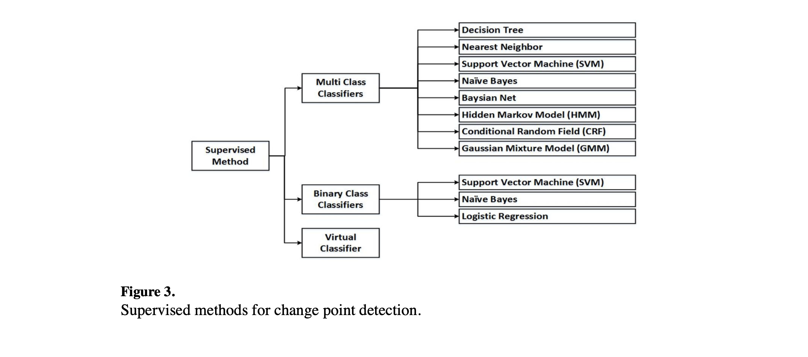
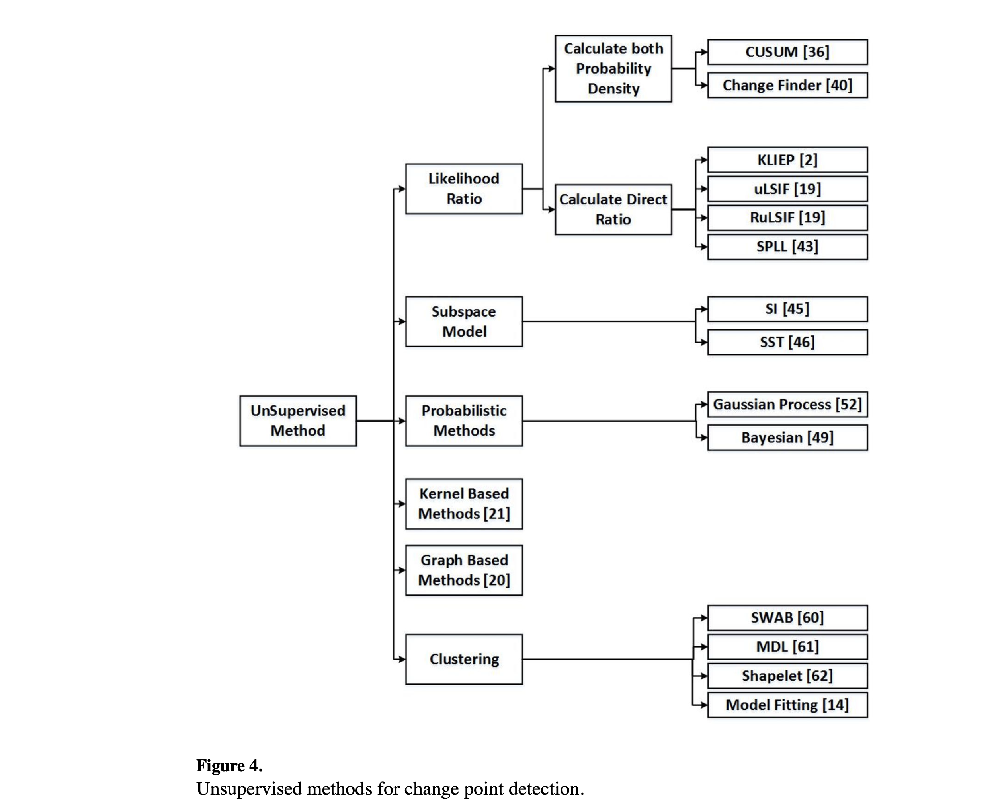
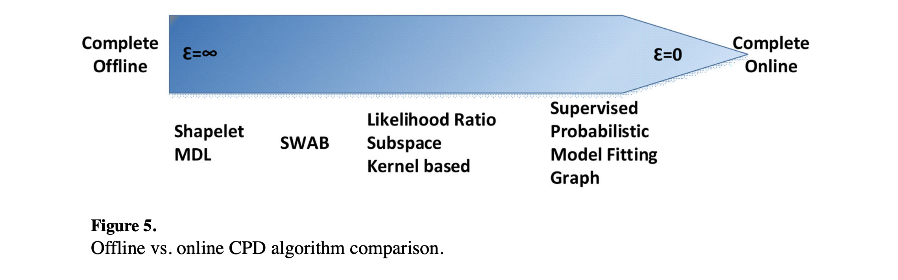
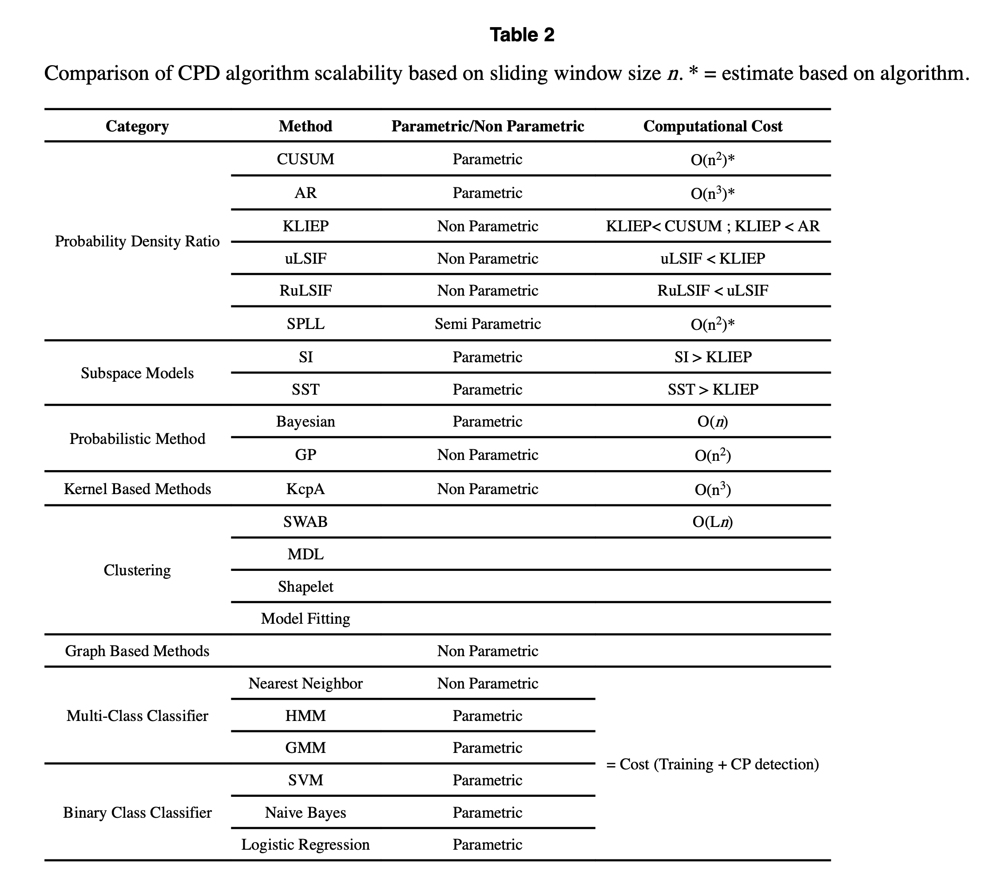
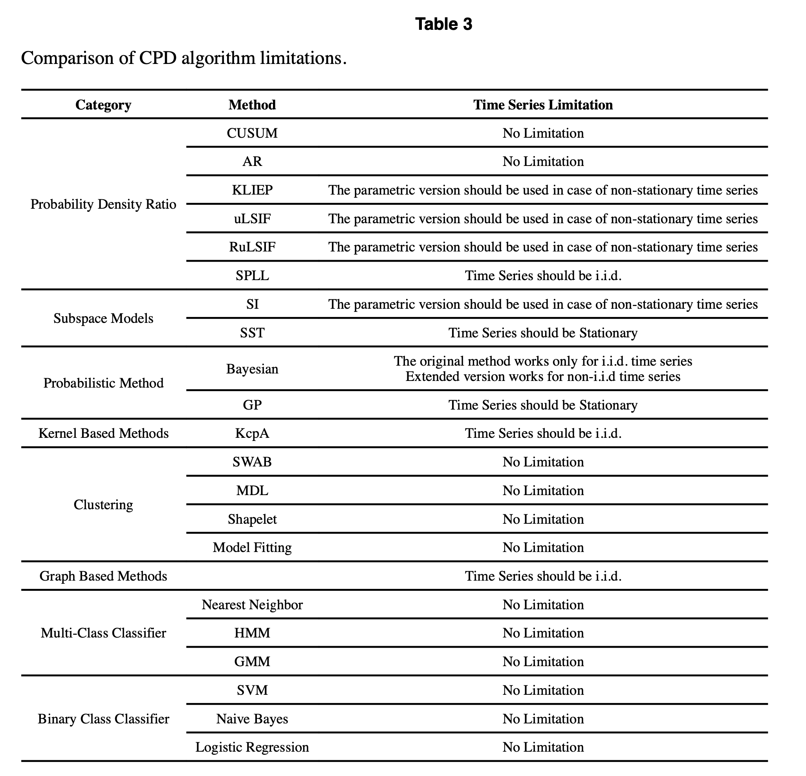
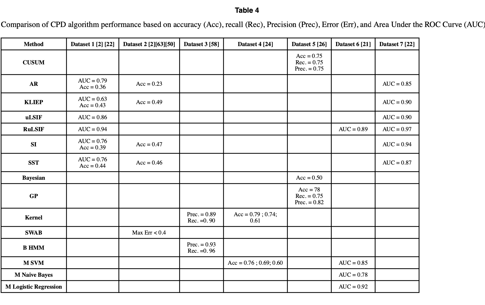

# A Suvey of Methods for Time Series Change Point Detection

**Samaneh Aminikhanghahi** and **Diane J. Cook**

## **Abstract**

变点是时间序列数据中的突变。这种突变可能表示状态之间发生的过渡。变点的检测在时间序列的建模和预测中非常有用，并在医疗状况监测、气候变化检测、语音和图像分析以及人类活动分析等应用领域中有所应用。这篇综述文章列举、分类并比较了许多用于检测时间序列中变点的方法。所研究的方法包括已经引入和评估的监督和无监督算法。我们引入了几项标准来比较这些算法。最后，我们提出了一些供社区考虑的重大挑战。

## Keywords

Change point detection; Time series data; Segmentation; Machine learning; Data mining

## 1 INTRODUCTION

时间序列分析在包括医学、航空航天、金融、商业、气象和娱乐在内的各个领域变得越来越重要。时间序列数据是描述系统行为的随时间变化的测量序列。这些行为可能由于外部事件和/或内部系统动力学/分布的变化而随时间变化[1]。变点检测（CPD）是发现数据中属性发生突变的问题[2]。分割、边缘检测、事件检测和异常检测是一些类似的概念，有时也会与变点检测一起应用。变点检测与众所周知的变点估计或变点挖掘问题密切相关[3] [4] [5]。然而，与CPD不同，变点估计试图建模和解释已知的时间序列变化，而不是识别变化的发生。变点估计的重点是描述已知变化的性质和程度。

在本文中，我们对变点检测这一主题进行了综述，并研究了该领域的最新研究。变点检测在数据挖掘、统计学和计算机科学领域已经研究了几十年。这个问题涵盖了广泛的现实世界问题。以下是一些示例。

**医疗状况监测**：对患者健康的连续监测涉及对生理变量（如心率、脑电图（EEG）和心电图（ECG））中的趋势检测，以实现自动化、实时监测。研究还探讨了特定医疗问题（如睡眠问题、癫痫、磁共振成像（MRI）解读以及对脑活动的理解）的变点检测 [6] [7] [8] [9]。 

**气候变化检测**：由于气候变化的可能发生和大气中温室气体的增加，利用变点检测的气候分析、监测和预测方法在过去几十年变得越来越重要[10] [11] [12]。 

**语音识别**：语音识别是将口语转换为文字或文本的过程。变点检测方法在这里被应用于音频分割和识别沉默、句子、单词和噪音之间的边界。 

**图像分析**：研究人员和从业者随着时间收集图像数据或视频数据，用于基于视频的监控。检测突发事件（如安全漏洞）可以被表述为变点问题。在这里，每个时间点的观测值是图像的数字编码 [15]。 

**人类活动分析**：基于从智能家居或移动设备观测到的传感器数据的特征，检测活动断点或过渡可以被表述为变点检测。这些变点对于分割活动、在最小化干扰的情况下与人类交互、提供活动感知服务以及检测行为变化（从而提供健康状态的见解）非常有用 [13 - 20] 。

在本综述中，我们将解释变点检测问题，并探讨如何使用不同的监督和无监督方法来检测时间序列数据中的变点。我们将基于它们的成本、限制和性能对所研究的技术进行比较和对比。最后，我们讨论研究中的空白，总结变点应用中出现的挑战，并提供继续研究的建议。

## 2 BACKGROUND

图1绘制了包含多个变点的时间序列示例。数据展示了1899年至2010年期间斯瓦尔巴群岛的长期平均年温度趋势。这些数据可以用于气候变化检测。该图突显了在此期间斯瓦尔巴群岛的气候经历了六个不同的阶段。我们将时间序列的这些部分称为时间序列的状态，或者称为过程参数不变的时间段。两个连续的不同状态由变点区分。变点检测的目标是通过发现这些变点来识别这些状态边界。

### 2.1 **Definitions and Problem Formulation**

我们首先介绍在本综述中使用的关键术语的定义。

**Definition 1:** A time series data stream is an infinite sequence of elements
$$
S = \{x_1,...,x_i,... \}
$$

where $x_i$ is a d-dimensional data vector arriving at time stamp i [17]

**Definition 2:** A ***stationary time series*** is a finite variance process whose statistical properties are all constant over time. This definition assumes that

- The mean value function $μ_t = E (x_t ) $​ is constant and does not depend on time t .
- The **auto covariance function** $γ(s , t ) = cov (x_s , x_t ) = E [(x_s − μ_s )(x_t − μ_t )]$ depends on time stamps s and t only through their time difference, or |s – t| .

**Definition 3:** ***Independent and identically distributed (i.i.d.) (独立同分布) variables*** are mutually independent of each other, and are identically distributed in the sense that they are drawn from the same probability distribution. An i.i.d. time series is a special case of a stationary time series.

**Definition 4:** Given a time series $T$ of fixed length $m$ (a subset of a time series data stream) and $x_t$ as a series sample at time $t$ , a matrix $WM$ of all possible subsequences of length $k$ can be built by moving a sliding window of size $k$ across $T$ and placing subsequence $X_p = \{x_p ,x_{p +1}, … , x_{p +k} \}$ (Figure 2) in the $p^{th}$ row of $WM$ . The size of the resulting matrix $WM$ is $(m − k + 1) × n $

**Definition 5:** In a time series, using sliding window $X_t$ as a sample instead of $x_t$ , an ***interval $χ_t$*** with Hankel matrix $\{X_t , X_{t +1}, … , X_{t +n –1}\}$ as shown in Figure 2 will be a set of $n$ retrospective subsequence samples starting at time t [2] [21] [22]

**Definition 6:** A ***change point*** represents a transition between different states in a process that

generates the time series data.

**Definition 7:** Let $\{x_m, x_{m+1}, . . , x_n \}$ be a sequence of time series variables. ***Change point detection (CPD)*** can be defined as the problem of hypothesis testing between two alternatives, the null hypothesis $H_0$: “No change occurs” and the alternative hypothesis $H_A$ : “A change occurs”  [23] [24]

1. $H_0$: $ℙ_{X_m} = ⋯ = ℙ_{X_k} = ⋯ = ℙ_{X_n}$.
2. $H_A$ : There exists  $m < k^* < n$ such that $ℙ_{X_m} = ⋯ = ℙ_{X_{k^*}} \neq ℙ_{X_{k^* + 1}} = ⋯ = ℙ_{X_n}$.

  where $ℙ_{X_i}$ is the probability density function of the sliding window start at point $x_i$ and $k^* $is a change point.

### 2.2 Criteria

在上一节中，我们对传统的变点检测进行了正式介绍。然而，变点检测的实际应用引入了一些需要解决的新挑战。这里我们介绍并描述其中的一些挑战。

#### **2.2.1 Online detection**

变点检测算法传统上被分类为“在线”(online)或“离线”(offline)。离线算法一次考虑整个数据集，回溯时间以识别变点发生的位置。这种情况下的目标通常是在批处理模式下识别序列中的所有变点。相比之下，在线或实时算法与它们监控的过程同时运行，在每个数据点可用时立即处理，其目标是在变点发生后尽快检测到变点，理想情况下是在下一个数据点到来之前。[25]

实际上，没有变点检测算法能在完美的实时环境中运行，因为它们必须检查新数据后才能确定变点是否发生在旧数据和新数据点之间。然而，不同的在线算法在变点检测发生之前需要不同数量的新数据。基于这一观察，我们将在本文中定义一个新术语。我们将称需要至少 $\epsilon$ 个数据样本才能在新批数据中找到变点的在线算法为 $\epsilon$-***real time algorithm**。*然后，离线算法可以视为 $\infty$-real，而完全在线的算法是 1-real 的，因为它可以针对每个数据点预测是否在新数据点到来之前发生变点。较小的 $\epsilon$ 值可能导致更强、更具响应性的变点检测算法。

#### 2.2.2 Scalability

来自人类活动和遥感卫星等来源的现实世界时间序列数据在数据点数量和维度数量上都变得越来越大。变点检测方法需要设计得具有计算效率，以便能够扩展到海量数据规模[26]。因此，我们比较了不同 CPD 算法的计算成本，以确定哪种算法能尽可能快地达到最佳（或足够好）的解决方案。比较算法计算成本的一种方法是确定算法是参数化的还是非参数化的。区分参数化和非参数化方法很重要，因为非参数化方法在处理大规模数据集方面表现出更大的成功。此外，参数化方法的计算成本高于非参数化方法，并且在数据集规模增大时扩展性较差[23]。

**参数化方法** (parametric approach)指定要由模型学习的特定函数形式，然后根据有标签的训练数据估计未知参数。一旦模型训练完成，训练示例可以被丢弃。相比之下，**非参数化方法** (nonparametric method)不对底层函数的形式做任何假设。相应的代价是，在进行推理时必须保留所有可用数据[27]。

成功的算法必须在决策质量和计算成本之间进行权衡。一种有前途的方法是使用任意时间（anytime）算法[28]，这种算法允许在任何时候中断执行并输出迄今为止获得的最佳解决方案。类似的方法是合同（contract）算法，这种算法也在计算时间和解决方案质量之间进行权衡，但在开始执行前预先指定允许的运行时间，作为一种合同约定。与任意时间算法不同，合同算法在执行前接收指定的允许执行时间参数。如果合同算法在分配时间完成之前被中断，可能不会产生任何有用的结果。可中断算法（例如任意时间算法）是一种执行时间不预先给定的算法，因此必须准备在任何时刻被中断，但它利用可用的时间不断提高其解决方案的质量。通常，每个可中断算法都是一个简单的合同算法，但反之则不成立[29。

#### 2.2.3 Algorithm constraints

变点检测（CPD）的方法还可以根据对输入数据和算法的要求进行区分。这些约束在选择适合特定数据序列的变点检测技术时非常重要。与时间序列数据性质相关的约束可能源于数据的平稳性、独立同分布（i.i.d.）、维度性或连续性[32]。

一些算法需要关于数据的信息，例如数据中的变点数量、系统中的状态数量以及系统状态的特征[33] [34]。参数化方法中的另一个重要问题是算法对初始参数值选择的敏感程度。

### **2.3 Performance Evaluation**

为了比较不同的 CPD 算法并估计预期的结果性能，需要性能衡量标准。已经引入了许多性能指标来评估变点检测算法，基于它们所做的决策类型[35]。CPD 算法的输出可能包含以下内容：

- Change-point yes/no decisions (the algorithm is a binary classifier)
- 不同精度水平的变点识别（即，变点发生在 x 时间单位内。此类型算法利用多类分类器或无监督学习方法）
- The time of the next change point (or the times of all change points in the series)

对于前两种类型的输出，可以利用评估监督学习算法的标准方法来评估变点检测器的性能。评估监督变点学习器性能的第一步是生成一个混淆矩阵，总结实际和预测的类别。表1展示了二元变点分类器的混淆矩阵。

- TP: True Positive，真正例
- FP: False Positive，假正例
- FN: False Negative，假负例
- TN: True Negative，真负例

以下是一些可以用来评估 CPD 算法的有用性能指标。这些指标虽然是在二元分类的背景下描述的，但可以通过独立或组合提供每个类别的衡量标准来扩展到更多类别的分类。

**准确率（Accuracy）**, calculated as the ratio of correctly-classified data points to total data points。这一指标提供了算法性能的高层次概念。其对应指标是错误率（Error Rate），计算公式为 1 - Accuracy。尽管准确率和错误率能够衡量总体性能，但它们并不能提供有关错误来源或错误在不同类别中的分布情况的见解。此外，对于类别不平衡的数据集（这在变点检测中很常见），它们在评估性能方面无效，因为它们认为不同类型的分类错误同样重要。在这种情况下，Sensitivity和 g-mean (几何平均数) 是有用的评估指标。

$$
Accurrancy = \frac{TP + TN}{TP + FP + FN + TN}
$$

**敏感性（Sensitivity）**, 也称为召回率（Recall）或真正例率（True Positive Rate, TP Rate）。这指的是目标类别（变点）中被正确识别的部分。

$$
Sensitivity = Recall = TP Rate = \frac{TP}{TP + FN}
$$

**G-mean（几何平均数）**。变点检测通常会导致类分布不平衡的学习问题，因为变点与总数据的比例很小。因此，G-mean 通常被用作变点检测性能的指标。它利用敏感性（Sensitivity）和特异性（Specificity）来评估算法的性能，既考虑了正类准确率（敏感性）也考虑了负类准确率（特异性）。

$$
G-mean = \sqrt{Sensitivity \times Specificity} = \sqrt{\frac{TP}{TP + FN} \times \frac{TN}{FP + TN}}
$$

**精确率（Precision）**。这是计算为真正例数据点（变点）与被分类为变点的总点数之比。

$$
Precision = \frac{TP}{TP + FP}
$$

**F-measure（也称为 f-score 或 f1 score）**。这种度量提供了一种结合精确率（Precision）和召回率（Recall）来衡量 CPD 算法整体有效性的方法。F-measure 计算为精确率和召回率的加权重要性比率。

**接收者操作特征曲线（Receiver Operating Characteristics Curve, ROC）**。基于 ROC 的评估有助于明确分析真正例率和假正例率之间的权衡。这是通过绘制一个二维图来实现的，横轴表示假正例率，纵轴表示真正例率。一个 CPD 算法会产生一个 (TP_Rate, FP_Rate) 对应于 ROC 空间中的一个点。通常，如果一个算法的点比另一个算法的点更接近 (0,1) 坐标（左上角），则该算法被认为优于另一个算法。为了评估算法的整体性能，可以看 ROC 曲线下的面积，称为 **AUC（Area Under the Curve）**。一般来说，我们希望假正例率低而真正例率高。这意味着 AUC 值越接近 1，算法越强。另一个可以从 ROC 曲线中导出的有用度量是等错误率**（Equal Error Rate, EER）**，这是假正例率和假负例率相等的点。一个强大的算法会使这个点保持在较低水平。

**精确率-召回率曲线（Precision-Recall Curve, PR Curve）**。可以生成 RPC 并用来比较不同的 CPD 算法。PR 曲线将精确率（Precision）作为召回率（Recall）的函数进行绘制。与在 ROC 曲线中理想的算法性能由位于空间的左上角的点表示不同，在 PR 空间中理想的性能是在右上角。与 ROC 曲线类似，可以计算 PRC下的面积来比较两个算法并尝试优化 CPD 性能。特别是当类别分布高度不均衡时，PR 曲线提供了有见地的分析。

如果将检测到的变点（Change Point, CP）与实际变点之间的时间差作为性能衡量标准（使用监督或无监督的 CPD 方法），那么上述指标就不再适用。评估这些算法的性能不像前一种情况那么简单，因为没有单一的标签来衡量算法的性能。然而，对于这种情况，仍然存在许多有用的指标，包括：

**平均绝对误差（Mean Absolute Error, MAE）**。这直接衡量预测的变点（CP）与实际变点的接近程度。预测的变点时间与实际变点时间的差的绝对值被求和，并在每个变点上进行归一化。

**均方误差（Mean Squared Error, MSE）** 是 MAE 的一个著名替代指标。在这种情况下，由于误差被平方，结果度量在分类数据中如果存在一些显著的异常值时将会非常大。

**平均符号差（Mean Signed Difference, MSD）**。除了计算预测变点与实际变点之间的差异外，该度量还考虑了误差的方向（预测在实际变点时间之前或之后）。

**均方根误差（Root Mean Squared Error, RMSE）**。它聚合了预测误差和实际误差之间的差异，并对每个差异进行平方以消除符号因素。最终计算平方根以抵消对单个差异进行平方的缩放因素。

**归一化均方根误差（Normalized Root Mean Squared Error, NRMSE）**。该度量消除了预测值单位大小对误差值的敏感性。NRMSE 使不同数据集之间的误差比较更加直接，并有助于解释误差度量。两种常见的方法是将误差归一化到观察到的变点的范围，或归一化到观察到的变点的均值。

## 3 Review

许多机器学习算法已经被设计、增强和改编用于变点检测。在这里，我们概述了一些常用于变点检测问题的基本算法。这些技术包括监督和无监督的方法，选择依据是算法的预期结果。

### 3.1 Supervised Methods

监督学习算法(Supervised learning algorithm) 是机器学习算法，通过从输入数据到数据目标属性（通常是类别标签）的映射来学习。图3概述了用于变点检测的监督方法。当采用监督方法进行变点检测时，机器学习算法可以被训练为二元或多类分类器。如果指定了状态数量，变点检测算法将被训练以找到每个状态边界。滑动窗口通过数据移动，将每两个数据点之间的每个可能划分视为一个潜在的变点。虽然这种方法的训练阶段较为简单，但需要提供足够数量和多样性的训练数据来表示所有类别。另一方面，分别检测每个类别提供了足够的信息，以找到检测到的变化的性质和数量。各种分类器可以用于这个学习问题。例如，决策树 (decision tree) [33] [34] [36] [37]、朴素贝叶斯(naive Bayes) [33]、贝叶斯网络(Bayesian net) [34]、支持向量机(support vector machine) [33] [34]、最近邻(nearest neighbor) [33] [20]、隐马尔可夫模型(hidden Markov model) [38] [39] [33]、条件随机场(donditional random field) [34] 和高斯混合模型（Gaussian mixture model, GMM）[38] [39]。

另一种方法是将变点检测视为二元分类问题(binary class problem)，其中所有可能的状态转换（change point）序列代表一类，所有状态内的序列代表另一类。虽然在这种情况下只需要学习两类，但如果可能的转换类型数量很大，这将是一个更复杂的学习问题。与前一种监督方法一样，在这种学习方法中，输入向量中的每个特征都表示可能变化的来源 [35]。因此，任何生成可解释模型（如决策树[decision tree) 或规则学习器[rule learner]）的监督学习算法不仅会识别变化，还会描述变化的性质。支持向量机(support vector machines) [21] [40]、朴素贝叶斯(naive bayes) [21]和逻辑回归(logistic regression) [21]已经使用这种方法进行了测试。由于通常状态内的序列比变点序列多得多，这类问题也会受到极端类不平衡的影响。

另一种监督方法是使用虚拟分类器（Virtual Classifier，VC）[4]。这种方法不仅仅是检测变化，而是实际解释发生在两个连续窗口之间的变化。虚拟分类器为第一个窗口中的每个样本附加一个假设标签（+1），为第二个窗口中的每个样本附加（-1），然后使用任何基于标记数据点的监督方法训练虚拟分类器(VC)。如果在两个窗口之间存在变点，它们应该被分类器正确分类，并且分类准确率 $p$ 应显著高于随机噪声 $p_{rand} = 0.5$。为了测试变化得分的显著性，使用二项分布(binomial distribution)的逆生存(inverse survival)函数来确定临界值(critical value), $p_{critical}$，在该值处伯努利试验(Berniulli trials) 预计以 $\alpha$ confidence level超过 $p_{rand}$。最后，如果 $p > p_{critical}$，则两个窗口之间存在显著变化。一旦检测到变点，使用两个相邻窗口中的所有样本重新训练分类器。如果某些特征在分类器中起主导作用，那么它们就是表征差异的特征。

### 3.2 Unsupervised Methods

无监督学习算法(unsupervised learning algorithms) 通常用于在未标记数据中发现模式。在变点检测的背景下，这些算法可以用于分割时间序列数据，从而基于数据的统计特征找到变点。无监督分割具有吸引力，因为它可以处理各种不同的情况，而不需要为每种情况进行事先训练。图4概述了用于变点检测的无监督方法。早期的方法利用**似然比(likelihood ratio)**，基于这样的观察：如果两个连续区间属于同一状态，则它们的概率密度(probability density) 相同。另一种传统解决方案是**子空间建模(subspace modelling)**，它使用状态空间(state space) 表示时间序列，从而通过预测状态空间参数检测变点。**概率(probabilistic)方法**基于自上一个候选变点以来观察到的数据估计新区间的概率分布(probability distributions)。相比之下，**基于核的方法(kernel-based methods)** 将观测映射到更高维的特征空间(feature space)，并通过比较每个子序列的同质性(homogeneity)来检测变点。**基于图的方法(graph based technique)**是新引入的方法，它将时间序列观测表示为图，并应用统计检验(statistical tests)基于这种表示来检测变点。最后，**聚类方法(clustering methods)**将时间序列数据分组到各自的状态中，并通过识别状态特征之间的差异来发现变化。

#### 3.2.1 Likelihood Ratio Methods

典型的统计变点检测公式是分析候选变点(dandidate change point) 前后数据的概率分布(probability distributions)，如果这两个分布显著不同，则将该候选点识别为变点。在这些方法中，通过监测时间序列数据中两个连续区间之间的似然比的对数(logarithm of the likelihood ratio) 来检测变点[2]。

这种策略需要两个步骤。首先，分别计算两个连续区间的概率密度(probability density)。其次，计算这些概率密度的比率。最常见的变点算法是**累积和（Cumulative Sum, CUSUM**）[41] [42] [43] [44]，该算法相对于指定目标累积偏差( accumulates deviations relative)，当累积和超过指定阈值时，指示存在变点。

**Change Finder** [2] [45] [22] 是另一种常用的方法，它将变点检测问题转化为基于时间序列的异常检测。此方法将**自回归（Auto Regression, AR）**模型拟合到数据上，以表示时间序列的统计行为，并逐步更新其参数估计，从而逐渐折扣(gradually discounted) 过去样本的影响。考虑时间序列 $xt$，我们可以使用 k 阶自回归模型(AR mode of kth) 来对时间序列建模：

$$
x_t = wx^{t-1}_{t-k} + \varepsilon
$$

Where ${x^{t-1}_{t-k} = (x_{t-1}, x_{t-2},...,x_{t-k})}$ are previous observation, $\omega = (\omega_1, \dots, \omega_k) \in \mathbb{R}^k$ 是常数，$\epsilon$ 是按照高斯分布生成的类似白噪声的正态随机变量。通过更新模型参数，可以在时间 $t$ 计算概率密度函数(probability density function)，并得到一系列概率密度 $\{p_t : t = 1, 2, \dots\}$ 。接下来，通过给每个数据点评分生成一个辅助时间序列(auniliary time-series)  $y_t$。这个评分函数定义为对数似然的平均值(average of the log-likelihood), $Score(y_t) = -\log p_{t-1}(y_t)$，或统计偏差(statistical deviation)，即 $Score(y_t) = d(p_{t-1}, p_t)$，其中 $d(*, *)$ 是由各种距离函数提供的，包括变差距离(variation distance)、Hellinger 距离(Hellinger distance)或二次距离(quadratic distance)。新的时间序列数据表示每对连续时间序列区间之间的差异。为了检测变点，需要知道两对连续差异之间是否存在突变。为此，再拟合一个自回归模型(AR Model)到基于差异的时间序列，并构建一个新的概率密度函数序列 $\{q_t : t = 1, 2, \dots \}$。变点评分使用前述的评分函数定义。较高的评分表示变点的可能性较高。

由于这些方法依赖于预先设计的参数模型，因此在实际的变点检测场景中灵活性较差，一些最近的研究引入了更灵活的非参数变体，通过直接估计概率密度比率来避免进行密度估计。这种密度比率估计 (density-ratio estimation)的基本原理是，了解两个密度意味着了解密度比率，但反之则不然：知道比率并不一定意味着知道两个密度，因为这种分解不是唯一的。因此，直接密度比率估计比密度估计要简单得多。基于这一思想，已经开发了直接密度比率估计的方法[2] [22]。这些方法通过非参数高斯核模型 (non-parametric Gaussian kernel model) 来建模两个连续区间 $\chi$  和 $\chi'$之间的密度比率，如下所示：

其中，$p(\chi)$ 是区间 $\chi$ 的概率分布，$ \theta = (\theta_1, \dots, \theta_n)^T $ 是从数据样本中学习到的参数，$X$ 是滑动窗口，且 $\sigma > 0$是核心参数。在训练阶段，通过最小化不相似度 (dissimilarity measure)来确定参数 $\theta$。在测试阶段，给定一个密度比率估计器(density-ratio estimator) $g(\chi)$，计算两个样本 $\chi_t$ 和 $\chi_{t+n}$ 之间不相似度的近似值。不相似度越高，该点越有可能是变点[2] [22]。

一种常用的不相似度量方法是 **Kullback-Leibler（KL）散度**：

Kullback-Leibler 重要性估计程序 (KLIEP) 使用 KL divergence 来估计密度比率。这个问题是一个凸优化问题(convex optimization problem)，因此可以通过梯度投影法 (gradient projection method) 简单地获得唯一的全局最优解 $θ$。投影梯度下降在每一步都朝负梯度方向移动，并投影到可行参数上。KL divergence的近似值由以下公式给出[2] [22]。

另一种直接密度比率估计器是**无约束最小二乘重要性拟合（uLSIF, Unconstrained Least-Squares Importance Fitting）**，它使用皮尔逊（PE, Pearson）散度作为不相似度量(dissimilarity measure)，表示如下：

作为 uLSIF 训练准则的一部分，密度比率模型(density-ratio model) 在平方损失(squared loss)下拟合到真实的密度比率。皮尔逊散度(approximator of the PE) 的近似值如下【22】：

根据第二个区间密度 $p' (x)$ 的条件，密度比率值可能是无界的。为了克服这个问题，采用 $0 \leq \alpha < 1 $的 α-relative PE 散度作为不相似度量，这种方法称为**Relative uLSIF (Relative uLSIF, RuLSIF)**。RuLSIF 度量如下：

当 α = 0 时，α-relative density ratio 简化为普通密度比率，并且随着 α 的增大，密度比率趋于“平滑”(smoother)。RuLSIF 的新颖之处在于其始终有上界 $\frac{1}{α}$，并且已经证明，相对密度比率估计的收敛速度比 uLSIF 更快 [22] [46]。

最近提出了一种**基于 Kullback-Leibler 统计的半参数变点检测器（Semi-Parametric Log-Likelihood Change Detector，SPLL）**[47] [48] [49]。假设变点前的数据（窗口 $W_1$）来自高斯混合模型(Gaussian mixture) $p_1(x)$。变点检测准则使用第二窗口 $W_2$ 中数据对数似然(log-likelihood)的上界，通过计算 $x$ 与其中心之间的最小平方马氏距离(squared Mahalanobis) 的分量索引来导出。如果 $W_2$ 不来自与 $W_1$ 相同的分布，那么距离的均值将偏离 n（其中 n 是特征空间[dimensionality of the feature space]的维度）。SPLL 的值大于或小于指定范围将表示变点。需要注意的是，所有这些估计方法的准确性都会受到数据噪声的影响  [46]。

#### **3.2.2 Subspace Model Methods**

另一项研究基于子空间 (subsapce) 分析进行变点检测，其中时间序列序列受到约束。这种方法与系统辨识方法有很强的联系，后者在控制理论领域得到了深入研究 [2]。

其中一种子空间模型方法称为**子空间辨识（Subspace Identification, SI）** [22] [50]。SI 基于系统的状态空间模型，并明确考虑了噪声因素。

$$
x(t + 1) = Ax(t) + Ke(t) \\
y(t) = Cx(t) + e(t)
$$

这里 $C$ 和 $A$ 是系统矩阵，$e(t)$ 表示系统噪声，K 是稳定的卡尔曼增益 (stationary Kalman gain)。在子空间方法中，我们使用不同的符号表示。由于在这些方法中 $x$ 表示模型状态，我们用 $y$ 表示时间序列。

在系统辨识中，扩展可观测矩阵是衡量系统的内部状态 $x(t)$ 如何通过其外部输出 $y(t)$ 来推断的一个指标。在这里，我们使用扩展可观测矩阵作为时间序列数据受约束的子空间的表示。

扩展可观测矩阵 (extended observability matrix)定义如下：

对于每个区间（如第2.1节所述），SI 使用 **LQ 分解 (LQ factorization)** 和标准化条件协方差(normalized conditional covariance)的**奇异值分解（SVD, Singular Value Decomposition）**来估计可观测矩阵。LQ 分解是将矩阵正交分解 (orthogonal decomposition)为下梯形矩阵 (lower trapezoidal matrices)。矩阵 $A$ 的 SVD 是将 $A$ 分解为三个矩阵的乘积 $A=UDV^T$，其中 $U$ 和 $V$ 的列是正交的 (orthonormal)，矩阵 $D$ 是对角 (diagonal) 矩阵，其对角线上的元素为正实数。在下一步中，计算子空间之间的差距，并将其用作衡量时间序列序列变化的度量。这一变化度量 $D$ 可以与指定的阈值进行比较，以确定当前点是否为变点。

这里，$\chi$ 表示新区间的 Hankel 矩阵，$U$ 通过对前一区间估计的扩展可观测矩阵进行 SVD 计算得出。

接下来我们将讨论的子空间模型方法称为**奇异谱变换（Singular Spectrum Transformation，SST）** [11] [22] [30]。SST 同样基于状态空间模型(state space model)，但与 SI 模型不同，它不考虑系统噪声。SST 将基于每个窗口的解释 Hankel 矩阵定义***轨迹矩阵 (trajectory matrix)***，如下公式所示：

其中，$L$ 是窗口长度，$K$ 是窗口数量。轨迹矩阵可以使用 SVD 分解为子矩阵。这些子矩阵由奇异值经验正交函数（singular value empirical orthogonal functions, EOF 函数）和主成分组成。基于距离的变点评分通过比较两个连续区间的轨迹矩阵的奇异谱(singular spectrums)来定义。

虽然这两种子空间模型方法都是基于预定义模型 (predefined model)的，但 SST 不考虑噪声对系统的影响。因此，与 SI 相比，它对参数值的选择更为敏感，并且在某些数据集上的准确性较低 [22] [50]。

#### **3.2.3 Probabilistic Methods**

早期的贝叶斯变点检测方法是离线的（∞ - real time），并且基于回顾性分割 (retrospective segmentation) [51] [52]。其中一种最早的在线**贝叶斯变点检测（BCPD, Bayesian change point detection）**方法是在假设一系列观测可以被划分为不重叠的状态分区的前提下提出的，并且时间序列中每个状态 ρ 内的数据是从某种概率分布 $P(x_t | \eta_{\rho})$ 独立同分布（i.i.d.）的 [31]。

与之前只考虑连续样本对的方法相比，BCPD 将新的滑动窗口特征与基于同一状态下所有先前区间的估计进行比较。BCPD 通过定义一个辅助变量 *运行长度* (*run-length*, $r_t$）来估计后验分布 (posterior distribution)，该变量表示自上一个变点以来经过的时间。给定时间点 $t$ 的运行长度，下一时间点的运行长度可以重置为 0（如果此时发生变点），或者增加 1（如果当前状态继续一个时间单位）。基于贝叶斯定理的运行长度分布可以表示为：

其中，$x^{(r)}_t$ 表示与运行长度  $r_t$ 相关联的观测集合，$P(r_t | r_{t-1})$、$P(x_t|r_{t-1},x^{(r)}_t)$和 $ P(r_{t-1}, x_{1:t-1}) $ 分别是该方程的先验(prior)、似然 (likelihood) 和递归 (recursive) 组件。条件先验在仅两个结果（$r_t = 0$ 或 $r_t = r_{t-1} + 1$）时为非零，从而简化了方程。

在这个方程中，$ H(\tau) = \frac{P(\tau)}{\sum_{t=\tau}^{∞} P(t)} $ 是一个风险函数 (hazard function)，定义为运行期间概率密度与概率密度总值的比率 [31] [53] [54]。似然项 (likelihood term) 表示最新数据属于当前运行的概率。这是最难计算的一项，当使用共轭指数模型 (conjugate exponential model)时，它往往是计算效率最高的 [31]。

在计算运行长度分布并更新相应的统计数据后，通过比较概率值进行变点预测。如果 $r_t$ 在分布中具有最高概率，则表示发生了变点，并且运行长度重置为 $r_t = 0$。如果没有发生变点，则运行长度加一，即  $ r_t = r_{t-1} + 1 $ [31] [53]。

这种方法后来通过在方程中结合不同子序列数据的似然性扩展到了非独立同分布（non i.i.d.）时间序列的一般情况。此外，通过使用简单近似，提出了一种简化方法，将算法复杂度从 $n^2$ 降低到 $n$。其关键思想是仅计算固定数量节点的联合概率权重 (joint probability weights)，而不是计算所有 $ \frac{n(n - 1)}{2} $ 节点的权重 [7]。

**高斯过程（Gaussian Process, GP）**是另一种用于平稳时间序列分析和预测的概率方法 [55]。高斯过程(GP) 是高斯分布的推广，定义为一组随机变量，其中任意有限数量的变量具有联合高斯分布 [56] [57]。在这种方法中，时间序列观测值 $\{x_t\}$ 被定义为高斯分布函数值 $f(t)$ 的噪声版本。
$$
x_t = f(t) + \varepsilon_t
$$

在这个高斯分布函数中，$\varepsilon_t$ 是噪声项，通常假设为高斯噪声项，且 $ \mathcal{N}(0, \sigma^2_n)$ 和 $ f(t) = \mathcal{GP}(0, K) $ 是由均值为零和协方差(covariance)函数 $K$ 指定的高斯过程分布函数。通常，协方差函数是使用一组超参数指定的。一种广泛使用的协方差函数是：

给定一个时间序列，GP（高斯过程）函数可以用于在时间  $t$ 进行正态分布预测。GP Change 算法使用高斯过程来估计时间 $t$ 的预测分布，使用的是通过时间 $(t - 1)$ 可用的观测值。然后，该算法计算实际观测值 $y_t$ 在参考分布 $\mathcal{N}(\hat{y}_t, \hat{\sigma}_t^2)$ 下的 p 值。使用阈值 $\alpha \in (0,1)$ 来确定实际观测值是否不符合预测分布，这表明可能存在状态变化（即变点）[56]。使用通过时间 $t-1$ 可用的观测值来检测变点，而不是仅使用来自最后状态的观测值，使得 GP 方法比 BCPD 更复杂但更准确。

#### **3.2.4 Kernel Based Methods**

虽然 kernel-based methods 通常作为监督学习技术使用，但一些研究使用无监督的 kernel-based 的检验统计量来检验时间序列过去和现在滑动窗口中的数据同质性(homogeneity)。这些方法将观测值映射到与再生核 $k(.,.)$ 和特征映射 $\Phi(X) = k(X, .)$ 相关的再生核希尔伯特空间（Reproducing Kernel Hilbert Space，RKHS）$\mathcal{H}$  中 [58]。然后，他们使用基于kernel Fisher 判别比率的检验统计量作为窗口之间同质性的度量。 (这句的原文：They then use a test statistic based upon the kernel Fisher discriminant ratio as a measure of homogeneity between windows.)

考虑两个观测窗口，样本 $X$ 的经验均值元素(empirical mean elements) 和协方差算子(covariance operators)（样本长度为 $n$）的计算公式如下：

其中，对于所有函数 $f \in \mathcal{H}$，张量积算子(tensor product operator) $u \otimes v$ 定义为 $(u \otimes v)f = \langle v, f \rangle_{\mathcal{H}} u$。现在，两个样本之间的核 Fisher 判别比率（Kernel Fisher Discriminant Ratio，KFDR）定义如下 [58] [24]：

其中，$\gamma$ 是正则化参数。

最简单的确定两个窗口之间是否存在变点的方法是将 KFDR 比率与阈值进行比较 [58]。另一种称为运行最大分区策略 (running maximum partition strategy) 的方法[24] 计算每个区间中所有连续窗口之间的 KFDR 比率。然后将最大比率与阈值进行比较以检测变点。

基于核的方法一个常见的缺点是它们高度依赖于核函数及其参数的选择，当数据位于中高维空间时，这个问题变得更加严重[23]。

#### **3.2.5 Graph Based Methods**

最近的几项研究表明，可以使用图论(graph theory) 工具来研究时间序列。图通常是从样本空间上的距离或广义不相似度(generalized dissimilarity) 导出的，时间序列观测值作为节点，基于其距离连接观测值。该图可以基于最小生成树(minimum spanning tree) [59]、最小距离配对(minimum distance pairing) [60]、最近邻图(nearest neighbor graph) [59] [60]或可见性图(visibility graph) [61] [62]来定义。

基于图的变点检测框架是一种非参数方法，它在等效图上应用双样本检验，以确定观测值中是否存在变点。在这种方法中，为每个数据序列构建图 $G$。每个可能的变点时间 $\tau$ 将观测值分为两个窗口：$\tau$ 之前的观测值和 $\tau$ 之后的观测值。图 $G$ 中连接这两个窗口的观测值的边数 $R_G$ 被用作变点的指示器，边数越少，变点的可能性越大。由于 $R_G$ 的值取决于时间 $t$，定义了标准化函数 $Z_G$：

其中，$E[\cdot]$ 和 $\text{VAR}[\cdot]$ 分别是期望值和方差。在图中所有数据点中，$Z_G$ 的最大值被确定为候选变点。如果最大值大于指定的阈值，则接受该变点 [23]。这种方法对于高维数据非常有效，并且需要的参数假设较少。然而，它没有利用太多时间序列观测本身的信息，而是依赖于定义合适的图结构。

#### **3.2.6 Clustering Methods**

从不同的角度来看，变点检测问题可以被视为具有已知或未知簇数量的聚类问题，即簇内的观测值是同分布的(identically distributed)，而相邻簇之间的观测值则不是。如果时间戳 $t$ 处的数据点属于与时间戳 $t+1$ 处的数据点不同的簇，则在这两个观测值之间发生了变点。

用于变点检测的一种聚类方法将滑动窗口和自底向上的方法结合成一种称为 **SWAB（Sliding Window and Bottom-up）**的算法[63]。原始的自底向上方法首先将每个数据点视为一个独立的子序列，然后合并具有相关合并成本的子序列，直到满足停止标准。相比之下，SWAB 保持一个大小为 $w$ 的缓冲区，以存储足够的数据来形成 5 到 6 个子序列。自底向上方法应用于缓冲区中的数据，并报告最左边的结果子序列。报告的子序列对应的数据从缓冲区中移除，并用序列中的下一个数据替换。

第二种聚类方法基于**最小描述长度（Minimum Description Length, MDL）**对子序列进行分组 [32]。长度为 $m$ 的时间序列 $T$ 的描述长度 $DL$ 是表示该序列所需的总位数，即：

$$
DL(T) = m * H(T)
$$
其中，$H(T)$ 是时间序列 $T$ 的熵(entropy).

基于最小描述长度（MDL）的变点检测是在簇空间上的一种自底向上的贪心搜索(greedy search)，这些簇可以包含不同长度的子序列，并且不需要指定簇的数量。该方法对枚举的模式进行聚类，而不是对所有子序列进行聚类。

在找到时间序列的模式后，应用了三个搜索操作：创建（create, 创建一个新簇）、添加（add, 将一个子序列添加到现有簇中）和合并（merge, 合并两个簇）。***比特保存值（bitsave）***表示通过将其中一个操作应用于时间序列所节省的总位数。

$$
bitsave = DL(Before) - DL(After)
$$
每个操作的 bitsave 定义如下：

1. Creating a new cluster $C$ from subsequences $A$ and $B$

$$
bitsave = DL(A) + DL(B) - DLC(C)
$$

$DLC(C)$ 是表示cluster $C$ 中所有子序列所需的比特数。

2. Adding a subsequence $A$ to an existing cluster C

$$
bitsave = DL(A) + DLC(C) - DLC(C')
$$

$C'$ is the cluster $C$ after including subsequence $A$.

3. Merging cluster $C1$ and $C2$ to a new cluster C

$$
bitsave = DLC(C_1) + DLC(C_2) - DLC(C)
$$

第一步是从模式(motifs)中创建一个cluster，并计算使用此步骤节省的比特数。在算法的下一个阶段，有两个可用的操作：创建或添加。新的子序列可以添加到现有cluster之一，或者可以作为新创建的cluster的唯一成员。为了将子序列添加到现有cluster，计算子序列与每个cluster之间的距离，以找到最接近子序列的cluster。搜索之后，更新最近的cluster以包含子序列，计算节省的比特数，并记录这些cluster。在每一步之后，如果合并两个cluster可以最大限度地减少描述长度（增加节省的比特数），则允许合并任何一对cluster。由于 MDL 技术需要离散(discrete)数据，因此该方法适用于离散化(discretized)的时间序列值。

另一种使用 **Shapelet 方法**对时间序列数据进行聚类以找到变点的方法 [64]。unsupervised-shapelet（u-shapelet）$S$ 是时间序列 $T$ 中的一个小模式，其中 $S$ 与时间序列某部分之间的距离远小于 $S$ 与时间序列其余部分之间的距离。Shapelet-based clustering 尝试根据整个时间序列的形状对数据进行聚类，搜索可以将时间序列子序列从数据集其余部分分离并移除的 u-shapelet。该算法在剩余数据中反复进行此搜索，直到没有数据可分离为止。使用一种贪婪搜索算法，尝试最大化两个数据子集之间的分离间隙来提取 u-shapelets。然后，任何聚类算法（例如具有欧几里得距离函数的 k-means）都可以用于对时间序列进行聚类并找到变点。

另一种时间序列聚类方法是**模型拟合(Model fitting)**。在这种方法中，当新的数据项或数据块不符合任何现有簇时，可以认为发生了变点 [17]。假设数据流为 $ \{x_1, \dots, x_i, \dots\} $，如果以下逻辑表达式为真，则在数据点 $x_i$ 之后发生变点。

其中，$ d(x_{i+1}, \text{center}(C_j))$ 是新进入的数据点 $x_{i+1}$ 与簇 $C_j$ 中心的欧几里得距离(Euclidian distance)，$\text{radius}(C_j)$ 是簇 $j$ 的半径，$K$ 是簇的数量，^ 是逻辑与符号。簇 $C$ 的半径（包含 $n$ 个数据点，均值为 $\mu$）的计算公式为：

## 4 DISCUSSION AND COMPARISON

前几节概述了文献中常用的变点检测算法。为特定数据集选择最合适的算法取决于应用中最重要的标准。在这里，我们基于几个常用的标准对变点检测方法进行比较。

### 4.1 Online vs Offline

变点检测的一个重要标准是实时或近实时识别变点的能力。完整的离线算法适用于一次处理整个时间序列的情况，而 ε-real time algorithms需要至少提前查看 ε 个数据点以确定候选变点。ε 的值取决于算法的性质以及每一步所需的输入数据量。在线算法在大小为 $n$ 的滑动窗口内处理数据。对于这些方法，$n$ 应该足够大以存储表示时间序列状态所需的数据，但又足够小以满足 epsilon 的要求。

**Supervised methods:** 一旦它们处理了足够的训练数据，这些方法将在当前窗口内预测是否存在变点。因此我们可以说supervised methods是 ***n*-real time**。

**Likelihood ratio methods:** 这些方法基于比较两个连续区间之间的概率密度(probability densities)。当新的回顾性子序列到来时，新的计算将返回结果，因此我们可以说这些方法是 ***n+k*-real time**。

**Subspace Model:**  这些技术中新区间的计算方式与似然方法相同。因此这些方法也是 ***n+k*-real time**。

**Probabilistic Methods:** 这些方法仅依赖于单个滑动窗口来检测变点，所以它们是 **n-real time**。

**Kernel Based Methods:** 无监督的基于核的方法基于滑动窗口。然而，与似然比方法一样，这些方法需要回顾性子序列的数据，因此它们是 ***n+k*-real time**。

**Clustering:** SWAB 技术是滑动窗口和自底向上的结合。SWAB 保持一个大小为 w 的缓冲区。自底向上方法应用于缓冲区中的数据，并报告最左边的子序列。因此，SWAB 是 **w-real time**。基于 MDL 的方法和基于 Shapelet 的方法需要一次性访问整个时间序列，所以它们offline或 **infinity-real time**。model fitting技术依赖于单个窗口，因此是 **n-real time**。

**Graph Based Method:** 该技术从单个窗口中导出图。如果当前窗口内存在变点，则报告该变点，因此该方法是 **n-real time**。

图5可视化了不同变点检测（CPD）方法之间的关系及其在complete offline和online processing之间的连续统上的位置。

### 4.2 Scalability

第二个重要标准是变点检测算法的计算成本(computational cost)。在表2中，我们比较了我们调查的算法（如果可用）的计算成本。如果作者没有提供此信息，则根据算法描述进行定性比较。总体而言，随着时间序列维度的增加，非参数方法在计算成本上更具优势，并且比参数方法更便宜。很难描述监督方法的成本，因为涉及两个复杂性：训练阶段的运行时间和变点检测阶段的运行时间。

据我们所知，目前没有任何现有的变点检测算法提供可中断或合同随时选项。这可以被视为未来研究的一个方向。

### **4.3 Learning Constraint**

大多数likelihood ratio 方法（除了 SPLL）和所有subspace model技术最初设计用于一维时间序列。因此，在处理 $d$ 维时间序列时，这些方法将所有维度合并在一起，生成一个具有 $d$-size向量的一维序列。虽然其他算法对时间序列的维度没有约束，但增加维度数量会增加算法的计算成本。

所有算法都接受离散(discrete)和连续(continuous)时间序列输入。一个例外是基于 MDL 的方法，它仅适用于离散输入值。

监督学习方法假设可以独立于当前时间序列状态检测到过渡期。相比之下，无监督学习算法假设时间序列数据在每个变点前后分布发生变化 [21]。虽然监督学习在检测变点方面经常优于无监督方法，但它们依赖于足够质量和数量的训练数据，而这些数据在现实世界中并不总是可获得的。多类监督算法是唯一需要知道可能的时间序列状态数量的算法组。

通常，非参数的变点检测（CPD）方法比参数方法更稳健，因为参数方法严重依赖参数的选择。此外，当数据具有中高维度时，参数方法的CPD问题变得更加复杂。

大多数无监督的变点检测（CPD）算法仅适用于有限类型的时间序列数据。其中一些算法仅适用于平稳或独立同分布（i.i.d.）的数据集，另一些算法则提供了适用于非平稳时间序列数据集的参数版本。相应的参数版本使用遗忘因子来消除旧观测值的影响。表3总结了我们调查的这些方法的限制。

### **4.4 Performance Evaluation**

使用若干人工和实际数据集来衡量变点检测（CPD）算法的性能。需要注意的是，由于使用了不同的数据集，客观比较不同CPD方法的性能非常困难。在这里，我们尝试描述一些流行的基准实际时间序列数据集，并比较不同CPD方法在这些数据集上的报告性能。

大多数研究没有提供任何比较，或者在某些情况下甚至没有提供性能测量。例如，对于 SPLL 和clustering methods，没有可用的结果。同样，基于图的 CPD 实验结果仅适用于不同的图结构，以证明准确性高度依赖于图的结构 [23]。包含性能分析的研究倾向于计算实际变点与检测到的变点之间的距离，并使用准确性、精度和召回率等离散指标来评估算法。表4总结了先前研究中使用以下数据集的报告性能：

**Dataset 1: Speech recognition:** 这是由日本国立信息学研究所（NII）提供的 IPSJ SIG-SLP 噪声语音识别语料库和环境（CENSREC）数据集 [65]。该数据集记录了嘈杂环境中的人声。任务是从录制的信号中提取语音部分。

**Dataset 2: ECG:** 这是在 UCR 时间序列数据挖掘存档中找到的呼吸数据集[66]。该数据集记录了患者在醒来时通过胸廓扩张测量的呼吸。该序列由医学专家手动分段。

**Dataset 3: Speech recognition:** 该数据集代表了 1980 年代流行的法国娱乐电视节目“Le Grand ‘Echiquier”的音轨。该数据集包含大约三个小时的音轨数据。

**Dataset 4: Brain-Computer Interface Data:** 这些脑-机接口（BCI）试验实验期间获得的信号自然显示出时间结构。相应的数据集构成了 BCI 竞赛 III 的基础。数据是在三个正常受试者的四个无反馈会话期间获得的，每个受试者被要求执行不同的任务，任务切换的时间是随机的。

**Dataset 5: Iowa Crop Biomass NDVI Data:** NDVI 时间序列数据在 2001 年至 2006 年期间作为数据产品提供。在该数据集中，每隔十六天进行一次观测。

**Dataset 6: Smart Home Data:** 该数据代表在 WSU 校园内的一间智能公寓中收集的传感器读数 [67]。公寓配备了红外运动/环境光传感器、门/环境温度传感器、灯开关传感器和电源使用传感器。数据标记了相应的人类活动，并且活动之间自然发生变化。

**Dataset 7: Human activity dataset:** 这是 2011 年人体活动传感联盟（Human Activity Sensing Consortium）挑战赛的一部分 [68]。该数据集提供了通过便携式三轴加速度计收集的人体活动信息。变点检测的任务是根据六种行为对时间序列数据进行分段：“停留”、“步行”、“慢跑”、“跳跃”、“上楼”和“下楼”。

总之，我们注意到，如果有足够的训练数据并且时间序列是平稳的，监督方法往往比无监督方法更准确。如果这些条件不满足，则无监督方法更有用。虽然没有全面的无监督方法性能比较，但从实验结果可以看出，RulSIF 一贯表现出较高的准确性。由于基于核的方法、子空间模型、CUSUM、AR 和聚类方法依赖参数来建模时间序列动态，它们在处理噪声数据或高度动态系统时表现不佳。

大多数无监督算法对可以处理的时间序列类型施加了限制。一个显著的例外是 AR 方法。此外，这些方法中的一些有用于非平稳数据的参数版本，这使得它们对参数的选择很敏感。对于高维时间序列数据，似然比和子空间模型不是最佳选择，因为它们无法直接处理多维数据。在这种情况下，基于图的方法或概率方法更有前景。

## **5. CONCLUSIONS AND CHALLENGES FOR FUTURE WORK**

在这篇综述中，我们展示了变点检测方法的最新进展，分析了它们的优缺点，并总结了变点检测中出现的挑战。文献中使用了监督和无监督方法来检测时间序列中的变化。尽管在过去十年中变点检测算法取得了显著进展，但仍然存在许多未解决的挑战。

一个重要问题是变点检测算法需要在线算法和许多现有方法的检测延迟。在许多现实应用中，变点用于选择和执行及时的行动，因此尽快找到变点是至关重要的。Anytime Algorithms 可以潜在地用于补偿算法延迟，并在检测变点的质量和平衡计算时间之间进行调整。另一种替代方法是采用需要较小窗口大小来计算变点评分的方法，例如贝叶斯方法。

另一个未解决的问题是算法的鲁棒性(robustness)。尽管关于这一点存在一些讨论，并且一般来说非参数方法比参数方法更为稳健，但文献中没有找到关于鲁棒性的正式分析。最后，几乎所有方法的变化检测都依赖于窗口大小。尽管小窗口相比大窗口能够检测到更多的局部变化，但它无法提前查看数据并且会增加成本。结合可变窗口大小可能会为每个子序列使用最佳窗口长度提供一个良好的解决方案。

然而，在许多实际数据分析问题中，单独的变点检测问题并没有特别的意义。例如，气候变化研究者可能更感兴趣的是温度变化的量，而不仅仅是检测到发生了变化。在这里，主要的兴趣是关于变化量和变化来源的详细信息。一些现有的技术我们已经调查过，提供了关于变化量或变化来源的信息，但仍需要进一步工作来开发更准确的变化分析或变化估计算法。每当发生变化时，计算每个特征的不相似度量是一种可能的解决方案，用于查找变化来源，然后可以使用总的不相似度量进行变化估计。

评估检测到的变点的显著性是无监督方法的另一个重要未解决问题。目前，大多数现有方法通过将检测到的变点得分与阈值进行比较来确定是否发生变化。选择最优的阈值是困难的。这些值可能依赖于具体应用，并且可能随着时间而变化。基于先前值开发统计方法来找到显著变点可能提供更大的自主性和可靠性。

最后，处理非平稳时间序列是变点检测的持续挑战。文献中确实存在检测概念漂移的方法，这些方法可以用于帮助解决这一问题[69] [70]。将变点检测与概念漂移检测(concept drift detection) 相结合是一个具有挑战性但重要的问题，因为许多现实世界的数据集是非平稳和多维的。

## References

1. Montanez GD, Amizadeh S, Laptev N. Inertial Hidden Markov Models: Modeling Change in Multivariate Time Series. AAAI Conference on Artificial Intelligence. 2015:1819–1825.

2. Kawahara Y, Sugiyama M. Sequential Change-Point Detection Based on Direct Density-Ratio Estimation. SIAM International Conference on Data Mining. 2009:389–400.

3. Boettcher M. Contrast and change mining. Wiley Interdiscip Rev Data Min Knowl Discov. May; 2011 1(3):215–230.

4. Hido S, Idé T, Kashima H, Kubo H, Matsuzawa H. Unsupervised Change Analysis using Supervised Learning. Adv Knowl Discov Data Min. 2008; 5012:148–159.

5. Scholz M, Klinkenberg R. Boosting classifiers for drifting concepts. Intell Data Anal. 2007; 11(1): 3–28.

6. Yang P, Dumont G, Ansermino JM. Adaptive change detection in heart rate trend monitoring in anesthetized children. IEEE Trans Biomed Eng. Nov; 2006 53(11):2211–9. [PubMed: 17073326]

7. Malladi R, Kalamangalam GP, Aazhang B. Online Bayesian change point detection algorithms for segmentation of epileptic activity. Asilomar Conference on Signals, Systems and Computers. 2013:1833–1837.

8. Staudacher M, Telser S, Amann A, Hinterhuber H, Ritsch-Marte M. A new method for change-point detection developed for on-line analysis of the heart beat variability during sleep. Phys A Stat Mech its Appl. Apr; 2005 349(3–4):582–596.

9. Bosc M, Heitz F, Armspach JP, Namer I, Gounot D, Rumbach L. Automatic change detection in multimodal serial MRI: application to multiple sclerosis lesion evolution. Neuroimage. Oct; 2003 20(2):643–56. [PubMed: 14568441]

10. Reeves J, Chen J, Wang XL, Lund R, Lu QQ. A Review and Comparison of Changepoint Detection Techniques for Climate Data. J Appl Meteorol Climatol. Jun; 2007 46(6):900–915.

11. Itoh N, Kurths J. Change-Point Detection of Climate Time Series by Nonparametric Method. World Congress on Engineering and Computer Science 2010 Vol I. 2010

12. Ducre-Robitaille JF, Vincent LA, Boulet G. Comparison of techniques for detection of discontinuities in temperature series. Int J Climatol. Jul; 2003 23(9):1087–1101.

13. Chowdhury MFR, Selouani SA, O’Shaughnessy D. Bayesian on-line spectral change point detection: a soft computing approach for on-line ASR. Int J Speech Technol. Oct; 2011 15(1):5–23.

14. Rybach D, Gollan C, Schluter R, Ney H. Audio segmentation for speech recognition using segment features. IEEE International Conference on Acoustics, Speech and Signal Processing. 2009:4197–4200.

15. Radke RJ, Andra S, Al-Kofahi O, Roysam B. Image change detection algorithms: a systematic survey. IEEE Trans Image Process. Mar; 2005 14(3):294–307. [PubMed: 15762326]

16. Nordli Ø, Przybylak R, Ogilvie AEJ, Isaksen K. Long-term temperature trends and variability on Spitsbergen: the extended Svalbard Airport temperature series, 1898–2012. Polar Res. Jan.2014 33

17. Tran D-H. Automated Change Detection and Reactive Clustering in Multivariate Streaming Data. Nov.2013

18. Shumway, RH., Stoffer, DS. Time Series Analysis and Its Applications. New York, NY: Springer New York; 2011.

19. Keogh E, Lin J. Clustering of time-series subsequences is meaningless: implications for previous and future research. Knowl Inf Syst. Aug; 2004 8(2):154–177.

20. Wei L, Keogh E. Semi-supervised time series classification. 12th ACM SIGKDD international conference on Knowledge discovery and data mining - KDD ’06. 2006:748.

21. Feuz KD, Cook DJ, Rosasco C, Robertson K, Schmitter-Edgecombe M. Automated Detection of Activity Transitions for Prompting. IEEE Trans Human-Machine Syst. 2014; 45(5):1–11.

22. Liu S, Yamada M, Collier N, Sugiyama M. Change-point detection in time-series data by relative densityratio estimation. Neural Netw. Jul.2013 43:72–83. [PubMed: 23500502]

23. Chen H, Zhang N. Graph-Based Change-Point Detection. Ann Stat. Sep; 2014 43(1):139–176.
24. Harchaoui Z, Moulines E, Bach FR. Kernel Change-point Analysis. Advances in Neural Information Processing Systems. 2009:609–616.

25. Downey AB. A novel changepoint detection algorithm. Dec.2008
26. Chandola V, Vatsavai RR. A gaussian process based online change detection algorithm for monitoring periodic time series | Varun Mithal - Academia.edu. SIAM international conference on data mining. 2011:95–106.

27. Raykar, VC. Scalable machine learning for massive datasets: Fast summation algorithms. University of Maryland; College Park: 2007.

28. Shieh J, Keogh E. Polishing the Right Apple: Anytime Classification Also Benefits Data Streams with Constant Arrival Times. IEEE International Conference on Data Mining. 2010:461–470.

29. Shlomo Zilberstein SR. Optimal Composition of Real-Time Systems. Artif Intell. 1996; 82(1):181– 213.

30. Moskvina V, Zhigljavsky A. An Algorithm Based on Singular Spectrum Analysis for Change-Point Detection. Commun Stat - Simul Comput. Jan; 2003 32(2):319–352.

31. Adams RP, MacKay DJC. Bayesian Online Changepoint Detection. Machine Learning. Oct.2007
32. Rakthanmanon T, Keogh EJ, Lonardi S, Evans S. Time Series Epenthesis: Clustering Time Series Streams Requires Ignoring Some Data. IEEE 11th International Conference on Data Mining. 2011:547–556.

33. Reddy S, Mun M, Burke J, Estrin D, Hansen M, Srivastava M. Using mobile phones to determine transportation modes. ACM Trans Sens Networks. Feb; 2010 6(2):1–27.

34. Zheng Y, Liu L, Wang L, Xie X. Learning transportation mode from raw gps data for geographic applications on the web. 17th international conference on World Wide Web - WWW ’08. 2008:247.

35. Cook, DJ., Krishnan, NC. Activity Learning: Discovering, Recognizing, and Predicting Human Behavior from Sensor Data. Wiley; 2015.

36. Zheng Y, Li Q, Chen Y, Xie X, Ma W-Y. Understanding mobility based on GPS data. 10th international conference on Ubiquitous computing - UbiComp ’08. 2008:312.

37. Zheng Y, Chen Y, Xie X, Ma W-Y. Understanding transportation modes based on GPS data for Web applications - Microsoft Research. ACM Trans Web. 2010; 4(1)

38. Cleland I, Han M, Nugent C, Lee H, McClean S, Zhang S, Lee S. Evaluation of prompted annotation of activity data recorded from a smart phone. Sensors (Basel). Jan; 2014 14(9):15861–79 [PubMed: 25166500]
39. Han M, Vinh LT, Lee YK, Lee S. Comprehensive Context Recognizer Based on Multimodal Sensors in a Smartphone. Sensors. Sep; 2012 12(12):12588–12605.

40. Desobry F, Davy M, Doncarli C. An online kernel change detection algorithm. IEEE Trans Signal Process. Aug; 2005 53(8):2961–2974.

41. Basseville, M., Nikiforov, IV. Detection of Abrupt Changes- theory and application. Prentice Hall; 1993.

42. Cho H, Fryzlewicz P. Multiple-change-point detection for high dimensional time series via sparsified binary segmentation. J R Stat Soc Ser B (Statistical Methodol. Mar; 2015 77(2):475–507.

43. Aue A, Hormann S, Horvath L, Reimherr M. Break Detection In The Covariance Structure Of Multivariate Time Series Models. Ann Stat. 2009; 37(6B):4046–4087.

44. Jeske DR, Montes De Oca V, Bischoff W, Marvasti M. Cusum techniques for timeslot sequences with applications to network surveillance. Comput Stat Data Anal. Oct; 2009 53(12):4332–4344.

45. Yamanishi K, Takeuchi J. A unifying framework for detecting outliers and change points from non-stationary time series data. 8th ACM SIGKDD international conference on Knowledge discovery and data mining - KDD ’02. 2002:676.

46. Yamada M, Kimura A, Naya F, Sawada H. Change-point detection with feature selection in high-dimensional time-series data. International Joint Conference on Artificial Intelligence. 2013

47. Kuncheva LI, Faithfull WJ. PCA feature extraction for change detection in multidimensional unlabeled data. IEEE Trans neural networks Learn Syst. Jan; 2014 25(1):69–80.

48. Kuncheva LI. Change Detection in Streaming Multivariate Data Using Likelihood Detectors. IEEE Trans Knowl Data Eng. May; 2013 25(5):1175–1180.

49. Alippi C, Boracchi G, Carrera D, Roveri M. Change Detection in Multivariate Datastreams: Likelihood and Detectability Loss. Oct.2015

50. Kawahara Y, Yairi T, Machida K. Change-Point Detection in Time-Series Data Based on Subspace Identification. 7th IEEE International Conference on Data Mining (ICDM 2007). 2007:559–564.

51. Chib S. Estimation and Comparison of multiple change point models. J Econom. 1998; 86(2):221–241.

52. Barry D, Hartigan JA. A Bayesian Analysis for Change Point Problems. J Am Stat Assoc. 1993; 88(421):309–319.

53. Lau HF, Yamamoto S. Bayesian online changepoint detection to improve transparency in human-machine interaction systems. 49th IEEE Conference on Decision and Control (CDC). 2010:3572–3577.

54. Tan BA, Gerstoft P, Yardim C, Hodgkiss WS. Change-point detection for recursive Bayesian geoacoustic inversions. J Acoust Soc Am. Apr; 2015 137(4):1962–70. [PubMed: 25920847]

55. Saatçi Y, Turner RD, Rasmussen CE. Gaussian Process Change Point Models. International Conference on Machine Learning. 2010:927–934.

56. Chandola V, Vatsavai R. Scalable Time Series Change Detection for Biomass Monitoring Using Gaussian Process. Conference on Intelligent Data Understanding 2010 - CIDU. 2010

57. Brahim-Belhouari S, Bermak A. Gaussian process for nonstationary time series prediction. Comput Stat Data Anal. Nov; 2004 47(4):705–712.

58. Harchaoui Z, Vallet F, Lung-Yut-Fong A, Cappe O. A regularized kernel-based approach to unsupervised audio segmentation. IEEE International Conference on Acoustics, Speech and Signal Processing. 2009:1665–1668.

59. Friedman JH, Rafsky LC. Multivariate Generalizations of the Wald-Wolfowitz and Smirnov Two-Sample Tests. Ann Stat. Jul; 1979 7(4):697–717.

60. Rosenbaum PR. An exact distribution-free test comparing two multivariate distributions based on adjacency. J R Stat Soc. 2005; 67:515–530.

61. Zhang J, Small M. Complex Network from Pseudoperiodic Time Series: Topology versus Dynamics. Phys Rev Lett. Jun.2006 96(23):238701. [PubMed: 16803415]

62. Lacasa L, Luque B, Ballesteros F, Luque J, Nuño JC. From time series to complex networks: the visibility graph. Proc Natl Acad Sci U S A. Apr; 2008 105(13):4972–5. [PubMed: 18362361]

63. Keogh E, Chu S, Hart D, Pazzani M. An online algorithm for segmenting time series. IEEE International Conference on Data Mining. 2001:289–296.

64. Zakaria J, Mueen A, Keogh E. Clustering Time Series Using Unsupervised-Shapelets. IEEE 12th International Conference on Data Mining. 2012:785–794.

65. [Accessed: 16–Sep-2015] CENSREC-4 - Speech Resources Consortium. [Online]. Available: http://research.nii.ac.jp/src/en/CENSREC-4.html

66. [Accessed: 16–Sep-2015] Welcome to the UCR Time Series Classification/Clustering Page. [Online]. Available: http://www.cs.ucr.edu/~eamonn/time_series_data/

67. [Accessed: 16–Sep-2015] Welcome to CASAS. [Online]. Available: http://casas.wsu.edu/datasets/
68. [Accessed: 16–Sep-2015] Hasc Challenge 2011. [Online]. Available: http://hasc.jp/hc2011/
69. Harel M, Mannor S, El-yaniv R, Crammer K. Concept Drift Detection Through Resampling. Proceedings of the 31st International Conference on Machine Learning - ICML-14. 2014:1009–1017.

70. Bach S, Maloof M. A Bayesian Approach to Concept Drift. Advances in Neural Information Processing Systems. 2010:127–135.
