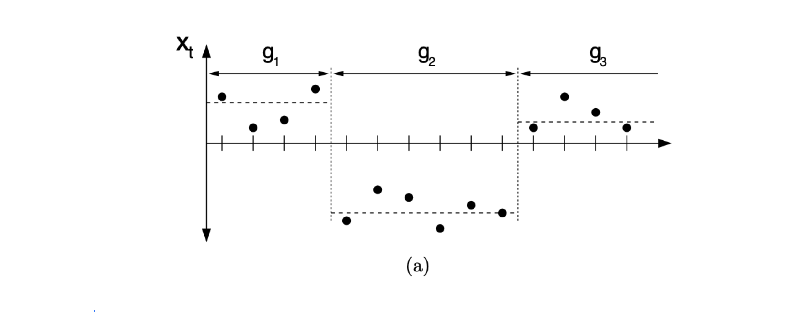
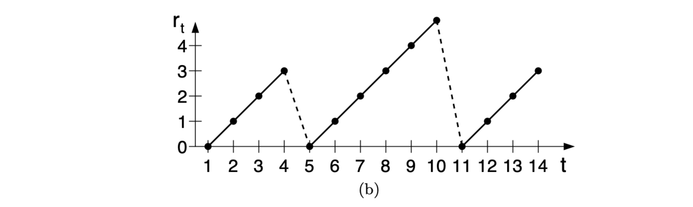
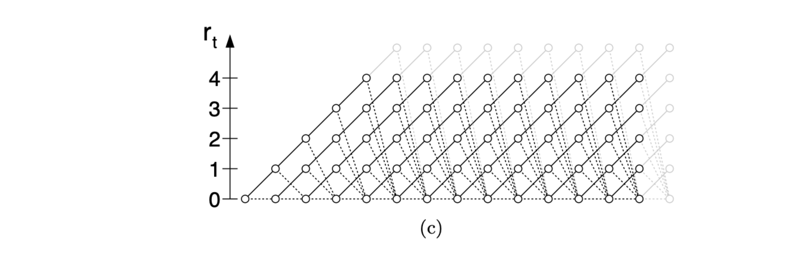
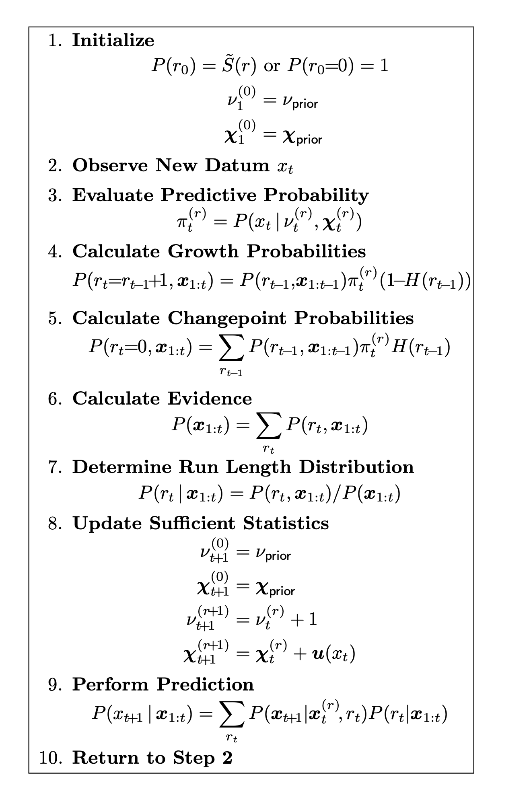

# Bayesian Online Changepoint Detection

Ryan Prescott Adams Cavendish Laboratory Cambridge CB3 0HE United Kingdom

David J.C. MacKay Cavendish Laboratory Cambridge CB3 0HE United Kingdom

## Abstract

变点是数据序列生成参数的突然变化。在线检测变点 (online detection of changepoints) 在金融、生物计量学和机器人等应用领域的时间序列建模和预测中非常有用。虽然频率方法已经产生了在线滤波和预测技术，但大多数贝叶斯论文主要关注回顾性分割问题( retrospective segmentation problem)。本文研究了变点前后的模型参数独立的情况，并推导出一个在线算法，用于对最近的变点进行精确推断。我们使用简单的信息传递算法计算当前“运行长度”(run)（即自上次变点以来的时间）的概率分布(probability distribution)。我们的实现高度模块化，因此该算法可以应用于多种类型的数据。我们通过展示算法在三个不同的真实数据集上的应用来说明其模块化特性。

## 1 INTRODUCTION

变点检测是识别序列数据生成参数的突然变化。作为一种在线和离线信号处理工具，它在过程控制 (process control)[1]、脑电图分析 (EEG analysis)[5, 2, 17]、DNA分割 (DNA segmentation)[6]、计量经济学 (econometrics) [7, 18]和疾病人口统计学 (disease demographics)[9]等应用中证明了其有效性。

从Page [22, 23]和Lorden [19]的开创性工作到最近使用支持向量机 (vector machines)[10]的工作，频率方法提供了在线变点检测器。与此相反，大多数贝叶斯变点检测方法是离线和回顾性的 (retrospective) [24, 4, 26, 13, 8]。除了少数例外[16, 20]，贝叶斯变点检测的论文主要集中在分割和从变点位置的后验分布 (posterior destribution) 中生成样本的技术上。

在本文中，我们提出了一种用于在线推断的贝叶斯变点检测算法(Bayesian changepoint detection algorithm for online inference)。我们专注于因果预测过滤 (causal predictive filtering)，而非回顾性分割；在仅给定已观察到的数据的情况下，生成下一个未见数据的准确分布。对于许多机器智能应用来说，这是一个自然的要求。例如，机器人必须基于过去的传感器数据在环境可能突然变化的情况下进行导航：例如，门现在可能关上了，或者家具可能已经移动了。在视觉系统中，当开关被切换或太阳出来时，亮度会发生变化。

我们假设一系列观察值 $x_1, x_2, ... , x_T$ 可以被划分为不重叠的乘积分区 (product partitions)[3]。分区之间的界限称为变点。我们进一步假设对于每个分区 $ρ$，分区内的数据从某个概率分布 $P (x_t | η_ρ)$ 独立同分布(i.i.d)。参数 $η_ρ, ρ = 1, 2, ...$ 也被认为是独立同分布的。我们将时间 $a$ 和 $b$ 之间（包括 $a$ 和 $b$）的连续观察值集表示为 $x_{a:b}$。变点之间间隔的离散先验概率分布 (priori probability distribution)表示为 $P_{gap}(g)$。

我们关注的是在给定目前观测到的数据的情况下，估计当前“run length”或自上次变点以来的时间的后验分布(posterior distribution)。我们用 $r$ 表示在时间 $t$ 的当前运行长度。我们还使用符号 $x^{(r)}_t$ 表示与运行长度 $r_t$ 相关的观测值集。由于 $r$ 可能为零，集合 $x^{(r)}$ 可能为空。我们在图 1(a) 和图 1(b) 中展示了运行长度 $r$ 和一些假设的单变量数据之间的关系。

Figure 1: 此图展示了如何使用运行长度描述变点模型。图1(a)显示了假设的单变量数据，这些数据在均值的变点处被分为三个段，长度分别为 $g_1 = 4$，$g_2 = 6$，和一个未确定长度的 $g3$。图1(b)显示了运行长度 $r_t$ 随时间的变化。当变点发生时，$r_t$ 会降至零。图1(c)展示了消息传递算法所在的格子图。实线表示概率质量向“上”传递，导致在下一个时间步长时运行长度增加。虚线表示当前运行可能被截断，运行长度降至零的可能性。

## 2 RECURSIVE RUN LENGTH ESTIMATION

我们假设可以在给定运行长度 $r_t$ 的条件下计算预测分布 (predictive distribution conditional)。然后，我们在当前运行长度的后验分布上进行积分 (integrate)，以找到边际预测分布 (marginal predictive distribution)：
$$
P(x_{t+1}∣x_{1:t})= \sum_{r_t}P(x_{t+1}∣r_t, x_t^{(r)})P(r_t∣x_{1:t})
$$
后验分布(posterior distribution):
$$
P(r_t|x_{1:t}) = \frac{P(r_t,x_{1:t})}{P(x_{1:t})}
$$
我们递归地写出运行长度和观测数据的联合分布.

请注意，预测分布 $P(x_t | r_{t-1}, x_{1:t}) $仅依赖于最近的数据 $x_t^{(r)}$。因此，我们可以基于两个计算，生成一个用于当前运行长度和数据的联合分布的递归消息传递算法:

1. 给定 $r_{t-1}$ 的 $r_t$ 先验分布
2. 给定自上次变点以来的数据的最新观测值的预测分布 (predictive distribution)。

### 2.1 THE CHANGEPOINT PRIOR

变点的条件先验分布 $P(r_t | r_{t-1})$赋予了该算法计算效率，因为它仅在两个结果上具有非零质量：运行长度继续增加并且 $r_t = r_{t-1} + 1$，或者发生变点并且 $r_t = 0$。

函数 $H(τ)$ 是 hazard function [11]。

在特殊情况下，$P_{\text{gap}}(g)$ 是时间尺度为 $λ$ 的离散指数(几何)分布时 (discrete exponential geometric distribution)，该过程是无记忆的(memoryless)，并且hazard function是常数，$H(τ) = 1/λ$。

图1(c)展示了由此产生的消息传递算法。在该图中，圆圈代表运行长度假设。圆圈之间的线表示在时间步之间递归传递的质量。实线表示概率质量向“上”传递，导致运行长度在下一时间步增加。虚线表示当前运行被截断，运行长度降至零。

### 2.2 BOUNDARY CONDITIONS

一个递归算法(recursive algorithm)不仅需要定义递推关系，还需要定义初始条件。我们考虑两种情况：

1. 先验上在第一个数据点之前发生了变点，例如在观察比赛时。在这种情况下，我们将初始运行长度的所有概率质量置于零，即 $P(r_0=0) = 1$。
2. 我们观察到一些最近的数据子集，例如在建模气候变化时。在这种情况下，初始运行长度的先验分布是归一化的*生存函数 (survival function)* [11]。

其中，$Z$ 是一个适当的归一化常数 (normailzing constant)，并且

### 2.3 CONJUGATE-EXPONENTIAL MODELS (共轭指数模型)

共轭指数模型特别适合与这里描述的变点检测方案结合使用。指数族似然函数(exponential family likelihoods) 允许使用有限数量的充分统计量进行推断，这些统计量可以随着数据的到来逐步计算。指数族似然函数的形式如下：

其中：

共轭-指数表示的优势在于，先验和后验都采用 $η$ 指数族 (exponential-family) 分布的形式，可以通过简洁的超参数 $ν$ 和 $χ$ 来概括。

我们希望推断与当前运行长度 $r_t$ 的数据相关的参数向量 $\eta$。我们将这个特定运行的模型参数表示为 $\eta^{(r)}_t$。在找到后验分布 $P(\eta_t | r_t, x_t)$ 之后，我们可以对参数进行边缘化处理 (marginalize out)，以找到条件于当前运行长度的预测分布。

这种边缘预测分布 (marginal predictive distribution)，尽管通常本身不是指数族分布，但通常是充分统计量的简单函数。当确切分布不可用时，诸如 Snelson 和 Ghahramani [25] 所描述的紧凑近似可能会有用。在本文中，我们将仅讨论确切情况，其中与特定当前运行长度相关的预测分布由 $\nu^{(r)}_t$ 和 $\chi^{(r)}_t$ 参数化。

### 2.4 COMPUTATIONAL COST

假设指数族似然函数，完整的算法如算法1所示。每个时间步的空间和时间复杂度在已观测到的数据点数量上是线性的。对算法的一个简单修改是丢弃分布尾部运行长度概率估计，其总质量小于某个阈值，例如 $10^{-4}$。这将使每次迭代的平均复杂度在期望运行长度 $E[r]$​ 的数量级上保持恒定，尽管最坏情况下的复杂度仍然是线性的。

算法1：带预测的在线变点算法 (The online changepoint algorithm with prediction)。未显示的一个额外优化是，当 $P(r_t|x_{1:t})$ 尾部的质量低于某个阈值时，截断每个时间步的向量。

