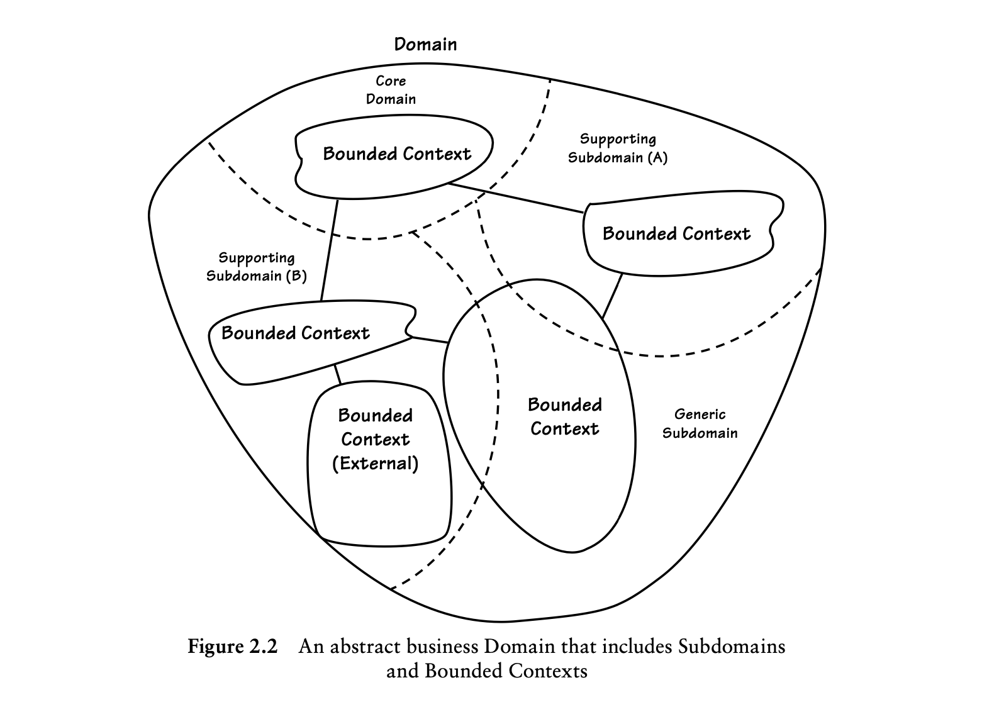

## 02 Domains, Subdomains, and Bounded Contexts

### Big Picture

#### Focus on Core Domain

With an understanding of Subdomains and Bounded Contexts,consider an abstract view of a different Domain found in Figure 2.2.This could repre-sent any domain, perhaps even the one you workin. I’ve removed the explicit names so you can mentally fill in theblanks. Naturally, our business goals are on a path of continuousrefinement and expansion reflected by ever-changing Subdomains and the models within. This diagram only captures the whole business Domain at a moment in time with a specificperspective, and one that could be somewhat short-lived.

在理解**子域**与**限界上下文**的基础上，我们来看图 2.2 中另一个领域的抽象视图。它可以指代任意领域，甚至是你实际工作中所处的领域。我已隐去具体名称，方便你在脑海中自行填充对应内容。我们的业务目标本就处在持续优化与拓展的过程中，这一点体现在不断迭代变化的子域及其内部模型上。该图表仅从特定视角，捕捉了整个业务领域在某一时刻的状态，而这样的视角往往时效性有限。

Now look at the top of the Domain boundary in Figure 2.2 and you’ll see the Subdomain labeled *Core Domain*. Introduced earlier, this is another aspect of DDD of major importance. A **Core Domain** is a part of the busi- ness Domain that is of primary importance to the success of the organization. Strategically speaking, the business must *excel* with its Core Domain. It is of utmost importance to the ongoing success of the business. That project gets the highest priority, one or more domain experts with deep knowledge of that Subdomain, the best developers, and as much leeway and leverage as possible to give the close-knit team an unobstructed success path. Most of your DDD project efforts will be focused on the Core Domain.

现在来看图 2.2 中**领域边界**的顶部，你会看到标注为**核心域（Core Domain）**的子域。前文已经提及，这是领域驱动设计（DDD）中另一项至关重要的内容。**核心域**是业务领域里对组织成功起核心作用的部分。从战略角度来说，企业必须在核心域上做到**出类拔萃**。它对业务的持续成功至关重要。核心域相关项目会被赋予最高优先级，配备一名或多名深耕该子域的领域专家、最优秀的开发人员，并尽可能提供充足的灵活空间与资源支持，为这支紧密协作的团队扫清障碍、铺就顺畅的成功路径。你在 DDD 项目中的大部分投入，都将聚焦在核心域上。

Two other kinds of Subdomains are found in Figure 2.2, *Supporting Sub- domain* and *Generic Subdomain.* Sometimes a Bounded Context is created or acquired to support the business. If it models some aspect of the business that is essential, yet not Core, it is a **Supporting Subdomain**. The business creates a Supporting Subdomain because it is somewhat specialized. Otherwise, if it captures nothing special to the business, yet is required for the overall business solution, it is a **Generic Subdomain**. Being Supporting or Generic doesn’t mean unimportant. These kinds of Subdomains are important to the success of the business, yet there is no need for the business to excel in these areas. It’s the Core Domain that requires excellence in implementation, since it will provide distinct advantages to the business.

图 2.2 中还出现了另外两类子域：**支撑子域（Supporting Subdomain）**和**通用子域（Generic Subdomain）**。企业有时会构建或引入限界上下文，用以支撑业务运转。如果某个子域所建模的业务环节不可或缺，但并非核心业务，那么它就是**支撑子域**。企业之所以打造支撑子域，是因为这类业务具备一定的专属特性。反之，如果该子域不具备企业独有的业务特色，却又是整体业务解决方案的必要组成部分，那么它就是**通用子域**。

归为支撑子域或通用子域，并不代表其无关紧要。这类子域对业务成功同样重要，只是企业无需在这些领域做到极致出众。唯有核心域需要在落地实现上精益求精，因为它能为企业带来独特的竞争优势。

### **Real-World Domains and Subdomains**

I have something more to tell you about domains. They have both a *problem space* and a *solution space.* The problem space enables us to think of a stra- tegic business challenge to be solved, while the solution space focuses on how we will implement the software to solve the problem of the business challenge. Here’s how that fits into what you’ve already learned:

- The problem space is the parts of the Domain that need to be developed to deliver a new Core Domain. Assessing the problem space involves exam- ining Subdomains that *already exist and those that are needed*. Thus,your problem space is the combination of the Core Domain and the Sub- domains it must use. The Subdomains in the problem space are usually different from project to project since they are used to explore a current strategic business problem. This makes Subdomains a very useful tool in assessing the problem space*.* Subdomains allow us to rapidly view differ- ent parts of the Domain that are necessary to solve a specific problem.
- The solution space is one or more Bounded Contexts, a set of specific software models. That’s because the Bounded Context ***is a specific solution*, a *realization view***, once developed. The Bounded Context is used to realize a solution as software.

关于领域，我还有一些内容要补充说明。领域包含两个部分：**问题空间（problem space）** 和**解决方案空间（solution space）**。问题空间帮助我们明确需要解决的战略性业务挑战，而解决方案空间则聚焦于如何通过软件实现，来解决这一业务挑战。这与你之前所学的内容关联如下：

- 问题空间是领域中为实现新的核心域而需要开发的部分。评估问题空间时，需要考察**已存在的子域和所需新增的子域**。因此，你的问题空间是核心域与其必须借助的子域的结合体。问题空间中的子域通常因项目而异，因为它们用于应对当前的战略性业务问题。这使得子域成为评估问题空间的一个非常实用的工具 —— 子域能让我们快速看清解决特定问题所需的领域各个不同部分。
- 解决方案空间是一个或多个限界上下文，即一组特定的软件模型。这是因为限界上下文一旦开发完成，就是一个**具体的解决方案**、一种**实现视图**。限界上下文用于将解决方案以软件的形式落地实现。

