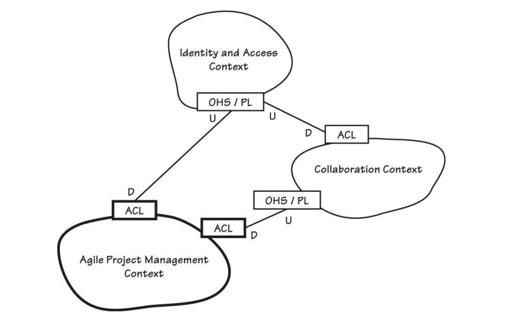

## 03 Context Maps

### Why Context Maps Are So Essential

#### Projects and Organizational Relationships 

What are the relationships between these Bounded Contexts and their individual project teams? There are several DDD organizational and integration patterns, one of which commonly exists between any two Bounded Contexts. Each of the following definitions is largely quoted from [Evans, Ref]:

这些限界上下文与它们各自的项目团队之间是什么关系？DDD中有几种组织与集成模式，任意两个限界上下文之间通常都存在着其中一种。以下各个定义主要引自[Evans, Ref]：

-  **Partnership**: When teams in two Contexts will succeed or fail together, a cooperative relationship needs to emerge. The teams institute a process for coordinated planning of development and joint management of integration. The teams must cooperate on the evolution of their interfaces to accommodate the development needs of both systems. Interdependent features should be scheduled so that they are completed for the same release.
- **合作关系（Partnership）**：当两个上下文中的团队休戚与共、成败相依时，就需要形成一种协作关系。团队应建立协调开发计划、共同管理集成的流程。双方必须合作演进各自的接口，以适应两个系统的发展需要。相互依赖的特性应排期在同一版本中完成。
- **Shared Kernel**: Sharing part of the model and associated code forms a very intimate interdependency, which can leverage design work or undermine it. Designate with an explicit boundary some subset of the domain model that the teams agree to share. Keep the kernel small. This explicit shared stuff has special status and shouldn’t be changed without consultation with the other team. Define a continuous integration process that will keep the kernel model tight and align the Ubiquitous Language (1) of the teams.
- **共享内核（Shared Kernel）**：共享部分模型及关联代码会形成非常紧密的相互依赖，这既可以放大设计工作的价值，也可能削弱它。划定一个明确的边界，指定领域模型的一个子集，双方团队同意共享这一子集。保持内核尽可能小。这种明确共享的部分具有特殊地位，未经与另一方团队商议不得更改。建立持续集成过程，使内核模型保持紧密，并协调双方团队的通用语言(1)。
- **Customer-Supplier Development**: When two teams are in an upstream-downstream relationship, where the upstream team may succeed interdependently of the fate of the downstream team, the needs of the downstream team come to be addressed in a variety of ways with a wide range of consequences. Downstream priorities factor into upstream planning. Negotiate and budget tasks for downstream requirements so that everyone understands the commitment and schedule.
- **客户方-供应方开发（Customer-Supplier Development）**：当两个团队处于上下游关系，且上游团队的成功可以独立于下游团队的命运时，下游团队的需求会以各种方式被满足，并带来截然不同的后果。下游的优先级应纳入上游的规划。协商并针对下游需求排定任务预算，让各方清楚承诺与进度。
- **Conformist**: When two development teams have an upstream/downstream relationship in which the upstream team has no motivation to provide for the downstream team’s needs, the downstream team is helpless. Altruism may motivate upstream developers to make promises, but they are unlikely to be fulfilled. The downstream team eliminates the complexity of translation between bounded contexts by slavishly adhering to the model of the upstream team.
- **顺从者模式（Conformist）**：上下游团队协作中，若上游团队没有意愿主动满足下游需求，下游团队将陷入被动。即便上游出于善意作出承诺，也往往难以兑现。此时下游团队选择**完全沿用上游的领域模型**，省去不同限界上下文之间的模型转换成本。
- **Anticorruption Layer**: Translation layers can be simple, even elegant, when bridging well-designed Bounded Contexts with cooperative teams. But when control or communication is not adequate to pull off a shared kernel, partner, or customer-supplier relationship, translation becomes more complex. The translation layer takes on a more defensive tone. As a downstream client, create an isolating layer to provide your system with functionality of the upstream system in terms of your own domain model. This layer talks to the other system through its existing interface, requiring little or no modification to the other system. Internally,the layer translates in one or both directions as necessary between the two models.
- **防腐层（Anticorruption Layer）**：若协作顺畅、系统设计规范，衔接不同限界上下文的转换层会简洁易用。但当双方管控不足、沟通不畅，无法落地共享内核、伙伴关系或客户 - 供方模式时，模型转换会变得复杂，转换层也转为**防御性设计**。下游客户端可搭建隔离层：基于自身领域模型封装上游系统的能力；该层通过上游现有接口完成交互，几乎无需改动上游系统。层内部会根据需求，在两套领域模型之间实现单向或双向转换。
- **Open Host Service**: Define a protocol that gives access to your subsystem as a set of services. Open the protocol so that all who need to integrate with you can use it. Enhance and expand the protocol to handle new integration requirements, except when a single team has idiosyncratic needs. Then, use a one-off translator to augment the protocol for that special case so that the shared protocol can stay simple and coherent.
- **开放主机服务（Open Host Service）**：定义一套协议，将自身子系统以服务形式对外暴露。开放该协议，供所有需要对接的合作方统一使用。持续迭代、扩展协议以适配通用集成需求；若仅个别团队存在特殊定制需求，则单独开发临时转换器做补充，保障通用协议保持简洁、逻辑一致。
- **Published Language**: The translation between the models of two Bounded Contexts requires a common language. Use a well-documented shared language that can express the necessary domain information as a common medium of communication, translating as necessary into and out of that language. Published Language is often combined with Open Host Service.
- **发布式语言（Published Language）**：不同限界上下文的模型交互，需要一套通用沟通语言。采用**文档完善的共享语言**作为交互媒介，承载各类领域信息，双方按需完成模型与该通用语言的互转。该模式常与开放主机服务结合使用。
- **Separate Ways**: We must be ruthless when it comes to defining requirements. If two sets of functionality have no significant relationship, they can be completely cut loose from each other. Integration is always expensive, and sometimes the benefit is small. Declare a bounded context to have no connection to the others at all, enabling developers to find simple, specialized solutions within this small scope.
- **各行其道（Separate Ways）**：梳理需求时需果断取舍：若两组业务功能不存在核心关联，可彻底切断彼此联系。系统集成本身存在成本，当收益微小时便无需强行对接。将该限界上下文设定为完全独立，开发人员可在独立范围内设计轻量化、高针对性的解决方案。
- **Big Ball of Mud**: As we survey existing systems, we find that,in fact, there are parts of systems, often large ones, where models are mixed and boundaries are inconsistent. Draw a boundary around the entire mess and designate it a Big Ball of Mud. Do not try to apply sophisticated modeling within this Context. Be alert to the tendency for such systems to sprawl into other Contexts.
- **大泥球（Big Ball of Mud）**：在存量系统中，常会出现大面积模块混杂、边界混乱的区域。将这一整片杂乱的模块整体圈定为**大泥球**限界上下文，不在其中开展复杂的领域建模工作。同时警惕这类系统向外蔓延、侵蚀其他限界上下文。

#### Mapping the Three Contents

This is a vital DDD project commitment. The Language of each Bounded Context must be honored in order for all models to remain pure.Linguistic segregation and a strict adherence to it help each team involved in the project to focus on their own Bounded Context and keep their vision correctly focused on their own work.

这是一项至关重要的DDD（领域驱动设计）项目承诺。必须尊重每个限界上下文的语言，以便所有模型保持纯粹。语言隔离及其严格遵守有助于项目中的每个团队专注于自己的限界上下文，并使他们的视野正确地聚焦于自身的工作。

Figure 3.5. The current Core Domain is marked with a bold boundary and integration points. The CollabOvation Supporting Subdomain and IdOvation Generic Subdomain are upstream.

图3.5：当前核心域以粗边界和集成点标出。CollabOvation支撑子域和IdOvation通用子域处于上游位置。

This nuance serves as another visual cue. Upstream models have influences on downstream models, as activities on a river that occur upstream tend to have impacts on populations downstream, whether positive or negative. Consider pollutants dumped into a river by a large city. Those pollutants may have little impact on that city, but downstream cities may face severe consequences. The vertical proximity of models on the diagram helps identify the upstream influences on downstream models. The labels U and D explicitly call this out between each associated model. These labels make vertical positioning of each Context less important, yet it is still visually appealing to employ them.

这种细微差别可作为另一种视觉提示。上游模型会对下游模型产生影响，就像河流中发生在上游的活动往往会对下游的群体产生影响一样，无论这种影响是积极的还是消极的。试想一座大城市向河中倾倒的污染物，这些污染物可能对该城市影响甚微，但下游城市却可能面临严重后果。图中模型间的垂直邻近关系有助于识别上游对下游模型的影响。标签 U 和 D 则明确标出了每个关联模型之间的这种关系。这些标签使得各上下文的垂直位置不再那么重要，但使用它们仍然在视觉上更具吸引力。

On the latest Map, note the connector boxes on the upstream side of each connection. Both of the connectors are labeled OHS/PL, an abbreviation identifying Open Host Service and Published Language. All three downstream connector boxes are labeled ACL, shorthand for Anticorruption Layer. The technical implementations are covered under **Integrating Bounded Contexts** (13). Briefly, these integration patterns have these technical characteristics:

在这张最新的映射图中，请注意每个连接上游一侧的连接器框。这两个连接器都标有 **OHS/PL**，这是**开放主机服务（Open Host Service）** 和**发布语言（Published Language）** 的缩写。所有三个下游连接器框都标有 **ACL**，即**防腐层（Anticorruption Layer）** 的简称。这些集成模式的技术实现在 **“集成限界上下文”（第13章）** 中详细阐述。简而言之，这些集成模式具有以下技术特征：

- **Open Host Service**: This pattern can be implemented as REST-based resources that client Bounded Contexts interact with.We generally think of Open Host Service as a remote procedure call (RPC) API, but it can be implemented using message exchange.
- **开放主机服务**：此模式可实现为基于REST的资源，供客户端限界上下文进行交互。我们通常将开放主机服务视为远程过程调用（RPC）API，但它也可以通过消息交换来实现。
- **Published Language**: This can be implemented in a few differ ent ways but is many times done as an XML schema. When expressed with REST-based services, the Published Language is rendered as representations of domain concepts. Representations may include both XML and JSON, for example. It is also possible to render representations as Google Protocol Buffers. If you are publishing Web user interfaces, it might also include HTML representations. One advantage to using REST is that each client can specify its preferred Published Language, and the resources render representations in the requested content type. REST also has the advantage of producing hypermedia representations,which facilitates HATEOAS. Hypermedia makes a Published Language very dynamic and interactive, enabling clients to navigate to sets of linked resources. The Language may be published using standard and/or custom media types. A Published Language is also used in an Event-Driven Architecture (4), where Domain Events (8) are delivered as messages to subscribing interested parties.
- **发布语言**：此模式可以通过几种不同方式实现，但通常以XML模式的形式呈现。在基于REST的服务中，发布语言表现为领域概念的**表示（Representations）**。表示形式可以包括，例如，XML和JSON。也可以使用Google Protocol Buffers作为表示形式。如果你发布的是Web用户界面，它也可能包含HTML表示。使用REST的一个优势是，每个客户端都可以指定其偏好的发布语言，而资源则会以所请求的内容类型呈现表示。REST还具有生成超媒体表示的优势，这有助于实现**HATEOAS**（超媒体作为应用状态引擎）。超媒体使发布语言非常动态和交互，使客户端能够导航到一系列链接的资源。发布语言可以使用标准和/或自定义媒体类型来发布。发布语言也用于**事件驱动架构（EDA）**（第4章），其中**领域事件**（第8章）作为消息传递给感兴趣的订阅方。
- **Anticorruption Layer**: A Domain Service (7) can be defined in the downstream Context for each type of Anticorruption Layer.You may also put an Anticorruption Layer behind a Repository (12) interface. If using REST, a client Domain Service implementation accesses a remote Open Host Service. Server responses produce representations as a Published Language. The downstream Anticorruption Layer translates representations into domain objects of its local Context. This is where, for example, the Collaboration Context asks the Identity and Access Context for a User-in-Moderator-role resource. It might receive the requested resource as XML or JSON, and then translates to a Moderator,which is a Value Object. The new Moderator instance reflects a concept in terms of the downstream model, not the upstream model.
- **防腐层**：可以在下游上下文中为每种类型的防腐层定义一个**领域服务**（第7章）。你也可以将防腐层放在**资源库**（第12章）接口之后。如果使用REST，则客户端领域服务实现会访问远程的开放主机服务。服务器响应会产生作为发布语言的表示。下游的防腐层会将这些表示转换为本地上下文的领域对象。例如，在这里，协作上下文（Collaboration Context）向身份与访问上下文（Identity and Access Context）请求一个“具有版主角色的用户”资源。它可能会以XML或JSON格式接收到所请求的资源，然后将其转换为**值对象**（Value Object）`Moderator`。这个新的`Moderator`实例体现的是下游模型中的概念，而非上游模型中的概念。

